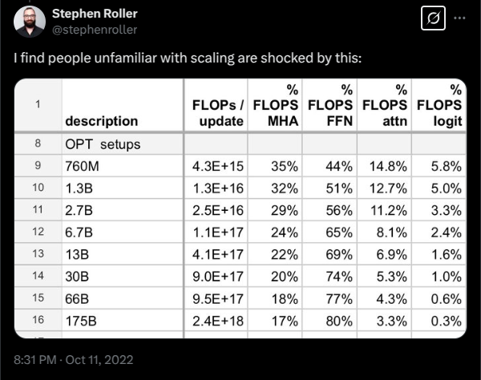
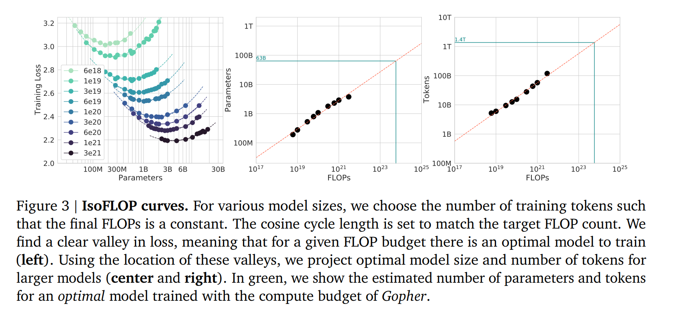
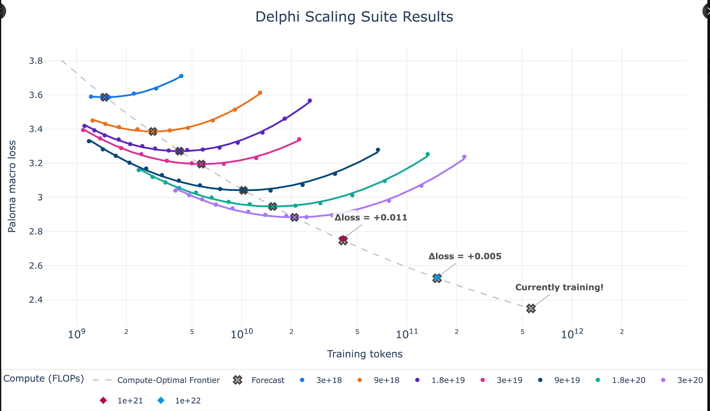

# Lecture 01 · 学习笔记(问题记录与 AI 解答)

- 讲义:仓库根目录 `lecture_01.py`(可执行讲义)
- 本地查看:前端打开 `http://localhost:5173/?trace=var/traces/lecture_01.json`(启动方法见 [README.md](README.md) 第 2 节)
- 状态:未开始(看完后在 [progress.md](progress.md) 更新)
- 用法:看讲时把内容写进 ①~③;然后把本文件路径填入 [README.md](README.md) 第 6 节的 Prompt 发给 AI,AI 会把回答直接写在问题下方并勾选 [x]

## ① 卡住的地方(尽量带讲义小节号或视频时间戳)
Example 1: fraction of FLOPs spent in attention versus MLP changes with scale. 

这里没有很明白想要表达什么。是否想要说：在小模型上做的比如attention的架构改进，在大模型上可能就不再适用，因为大模型的计算量主要消耗在MLP上，而不是attention上？
  - AI: 你的理解方向对,但这句话的落点是「**直觉不跨规模迁移**」,不只针对某个改进是否失效:它的作用是在第一讲论证——为什么我们不能只在小模型上做实验就把结论搬到大模型,以及为什么这门课把「资源账本(resource accounting)」放在核心位置。更具体地:每个 token 上,attention 的 FLOPs 量级约为 $O(L\cdot d)$(L=序列长度,d=隐藏维度,由 QK^T、AV 等矩阵乘得出),而 MLP 与 embedding 之外的参数部分约 $O(d^2)$;模型scale主要靠增大 $d$,所以 **MLP 占总 FLOPs 的比例随规模上升、attention 占比下降**(数十 B 以上、常见上下文下 attention 通常只占小头)。推论:小模型上「改进 attention」收益明显,大规模时总收益被稀释——所以该看的是目标规模下的占比而非小模型直觉。两个补充:1) 序列变长时 attention 是 $O(L^2)$,占比会回升,长上下文是另一条线;2) 精确比例随架构/超参变,你会在 systems 单元的 resource accounting 和 Assignment 2 里亲手算。出处:讲义引的 Stephen Roller 帖子(https://x.com/stephenroller/status/1579993017234382849)。
一句话：attention的计算量和model dim d的一次方成正比；MLP的计算量和model dim d的平方成正比；scaling up主要是增大d。所以随着模型scale up，MLP占比越来越大，attention占比越来越小。
  - flop的定义和计算公式
  - AI: FLOP = Floating-point OPerations,一次浮点运算;工程上常说 MAC(乘加)记 2 FLOPs(一次乘+一次加)。scaling law 里用的标准恒等式是 $C \approx 6ND$ 其中 C=训练总 FLOPs,N=参数量,D=训练 token 数。6N 的来源(每个 token):前向约 2N(每个参数平均被乘加约 2 次),反向约 4N(梯度 + 更新,backward 比 forward 贵约 2 倍),合计 6N。这是对标准 dense Transformer 的近似:忽略了 attention、logits 层、以及激活等二阶项,并假设 batch 足够大;Hoffmann et al. 2022(Chinchilla)用的就是这条近似。真正逐层算清楚是你 Assignment 1/2 里 resource accounting 的内容(讲义有示例:70B × 1T tokens ≈ 4.2e23 FLOPs,即 $6\times 70\times10^9\times10^{12}$)。
一次乘加的理解：对于一个长度为
  - AI 把"一次乘加(MAC)"讲透——
  - **它是什么**:一次乘加(multiply-accumulate, MAC)指 $a \leftarrow a + x\cdot y$ 这个组合:先算 $x\cdot y$ 一次乘法,再把结果累加进累加器一次加法。硬件上有专门的 FMA(fused multiply-add)指令,一条指令、一次舍入完成 $x\cdot y + a$;tensor core 则一次做一大块矩阵的乘加。
  - **为什么记 2 FLOPs**:FLOP = "一次浮点运算"(1 次乘法 = 1 FLOP,1 次加法 = 1 FLOP),一个 MAC 含 1 乘 + 1 加 → **2 FLOPs**。⚠️ 口径陷阱:有些文献直接按 MAC 个数计数(1 MAC = 1 operation),两种口径差 2 倍;GPU 规格表的峰值 FLOP/s 用的是 FLOP 口径,比较 MFU 要同口径。
  - **逐层例子**:

    | 表达式 | 乘 | 加 | FLOPs(FLOP 口径) | MAC 口径 |
    |---|---|---|---|---|
    | $y=wx+b$ | 1 | 1 | 2 | 1 |
    | $n$ 维点积 $\sum_i x_iw_i$ | $n$ | $n-1$ | $2n-1$ | $n$ |
    | $(B\times D)@(D\times K)$ | $BDK$ | $BDK-BK$ | $\approx 2BDK$ | $BDK$ |

  - 点积的"加"是 $n-1$ 而不是 $n$:第一项相乘后直接当起点,无需加(Lecture 02 里就精确写成 `flops = 2 * n - 1  # n multiplications, n-1 additions`);工程上习惯忽略这个 $-1$。
  - 矩阵乘的来历:每个输出元素 = 一次长度 $D$ 的点积 = $D$ 个 MAC = $2D$ FLOPs;共 $B\cdot K$ 个输出 → $2BDK$ FLOPs。这就是 Lecture 02 的 `actual_num_flops = 2 * B * D * K`(注释原话:one multiplication and one addition per (i,j,k) triple)。
  - 比如：一个A*B矩阵@B*C矩阵，得到A*C矩阵，flops的计算可以这样理解：A*C矩阵中每个输出元素，都是由两个B长度的向量相乘产生的，包含B次乘加（忽略加法的-1），计算量是2*B次，则A*C矩阵中有A*C个输出元素，所以总的flops是2*B*A*C。
  - **与 6ND 对上**:每个参数每处理一个 token,恰好被"乘一次、加一次"(累加)= 1 MAC = 2 FLOPs;所以前向 = $2N$ FLOPs/token。上面旧回答里"每个参数平均被乘加约 2 次"的措辞不够准确,更准确的说法是**每个参数 1 个 MAC = 2 FLOPs**;再乘上数据量 D、并叠加反向约 2 倍 → $6ND$。
  - **两个易错点**:① FLOPs ≠ 运行时间(同样的 FLOPs,memory-bound 的算子照样慢——Lecture 02 的 "FLOPs are not runtime!" / Lecture 03 P16);② 规格表峰值还依赖 dtype 与稀疏/稠密(H100 bf16 稀疏 1979 vs 稠密 ≈989.5 TFLOPS),拿 MFU 比较时分子分母必须同口径。
  - Kernels章节中：Kernels和GPU区别？Kernels是啥？另外，其中的Naive和Fused解释下。
  - AI: Kernel ≠ GPU:GPU 是硬件,kernel 是**跑在 GPU 上的一个函数/程序**(由 CPU 启动,内部几千上万个线程并行执行)。你用 PyTorch 时,每个算子(matmul、relu、layernorm…)都会在 GPU 上 launch 一个标准 kernel;kernel 间数据要经过显存 HBM 读写。Naive vs Fused 讲的是**最小化数据搬运**:
  - AI: - Naive:算子 A 的 kernel:读 HBM→算 A→写 HBM;算子 B 的 kernel 再读 HBM→算 B→写 HBM——每个算子都往返一次显存。
  - AI: - Fused:把 A 和 B 合并进一个 kernel:读 HBM 一次→算 A 和 B→写一次。现代 GPU 很多算子是 memory-bound(瓶颈是显存带宽不是计算),省一次读写就是近乎翻倍的收益。讲义的原则就一句:organize computation to minimize data movement。
以及Strategies: operator fusion (matmul + activation), tiling (FlashAttention)
  - AI: 这是把上面原则落地的两种手段:1) operator fusion = 把多个连续算子合成一个 kernel,典型如把 matmul 和它的激活/残差合并,中间结果不落 HBM;2) tiling = 把矩阵/序列切成块(tile),让块在 SM 的 shared memory/寄存器里被反复复用,而不是每次都回 HBM 读——FlashAttention 就是 tiling 的代表:分块计算 softmax-attention,从不需要物化 $L\times L$ 的注意力矩阵,复杂度不变但显存占用从 $O(L^2)$ 降到 $O(L)$。深度细节在 systems 单元/Assignment 2(Triton 手写 kernel)展开。
    
Warp divergence, memory coalescing, bank conflicts, occupancy, bulk-async memory transfers
  - AI: 这些是 GPU 编程/性能术语,先给一句直觉,后面 systems 讲座和 Assignment 2 会逐个练到:
  - AI: - warp:GPU 的基本调度单位 = 32 个线程,同一时刻执行同一条指令(SIMT);
  - AI: - warp divergence:warp 内线程走了不同 if/else 分支,只能分时执行,另一路空转——尽量避免;
  - AI: - memory coalescing:让 warp 中相邻线程访问相邻地址,才能合并成一次内存事务,否则带宽浪费(访存性能的头号规则);
  - AI: - bank conflicts:shared memory 分成约 32 个 bank,同一 warp 同时访问同一 bank 的不同地址会冲突串行化;
  - AI: - occupancy:SM 上驻留的 warp 数占容量的比例,越高越能靠切换线程隐藏访存/指令延迟;
  - AI: - bulk-async transfers:用异步拷贝(cp.async / TMA)把数据搬运与计算重叠,不让 SM 空等。
    
Write kernels in CUDA/Triton/CUTLASS/ThunderKittens
这块也没看懂。
  - AI: 意思是:为了上面那些优化,你可以**绕过 PyTorch 预置算子,自己写 kernel**。四个选项是不同层次的工具:CUDA = NVIDIA 的原生语言(最底层、最灵活也最累);Triton = OpenAI 出的 Python 风格 kernel 语言,自动帮你做 tiling/调度,CS336 的 Assignment 2 就是用 Triton 写 fused RMSNorm; CUTLASS = NVIDIA 的高性能模板库(FlashAttention 官方版基于它);ThunderKittens = MIT 的快速 kernel 框架。前沿大模型基本都重度自研/改写 kernel,课程的态度是「make GPUs go brrr」——默认 kernel 太浪费,能 fuse 就 fuse。

Speculative decoding的含义和原理
  - AI: 一句话:用便宜的小模型先「猜」出 k 个 token,再用大模型一次前向并行校验并接受——**加速且不改变输出分布(精确解码)**。原理分三步:1) draft 模型(小而快)自回归地草拟 k 个 token;2) 大模型对草稿序列做一次并行 forward,得到每个位置的真实分布;3) 逐位置按拒绝采样规则接受草稿(接受概率 $p_{\text{target}}/p_{\text{draft}}$,不一致处截断并修正采样),被接受多少就少跑多少步串行 decode。为什么快:decode 阶段是 memory-bound、一次只出一个 token,而把 k 个候选拼成一个 batch 让大模型并行打分,边际成本远低于 k 次串行;草稿命中率高时加速明显(常见 2-3x)。注意它是「exact」的:拒绝采样保证和直接大模型采样同分布,不是近似。本讲只提及,完整算法与图示在讲义 Lecture 10(inference 单元,speculative_sampling());原始论文:Leviathan et al. 2023(https://arxiv.org/abs/2211.17192)与 Chen et al. 2023(https://arxiv.org/abs/2302.01318)。

Fit a scaling law to predict the loss of the scaling recipe at the target scale (e.g., 1e25 FLOPs)这块的核心思想和作用，解决的问题
  - AI: 解决的核心问题:**目标规模(如 $10^{25}$ FLOPs)太贵,不可能直接做超参实验**,那怎么知道「某个 scaling recipe(FLOPs → 超参的规则)」在目标规模上能拿到多少 loss?做法:对同一 recipe,在若干小规模(如到 $10^{24}$)上跑实验得到 (C, loss) 点,用幂律拟合 $L(C)=aC^{-\alpha}+c$ 之类,外推到 $10^{25}$;于是你可以在花大钱之前:1) 预测该 recipe 的最终 loss;2) 用多次小实验比较不同 recipe、挑目标规模上预测最优的。要点:scaling law 不是自动成立的,它要求你小心构造 recipe(参数量/数据量/LR 随规模怎么走的规则都要定好),否则外推不可靠。这对应 Assignment 3:定义 training API→小规模取样→拟合→提交外推超参与 loss 预测。

Predictability is at least as important as optimality!这个的深入理解，这里应该是从scaling raw的角度触发的一个深刻理解
  - AI: 你的感觉对,这是 scaling 视角的核心态度转变:**工程/研究决策真正依赖的是「可预测性」而非「小规模上的最优」**。一个小规模上最优化(loss 最低)的 recipe,如果它的行为无法外推,对你做大规模决策毫无价值;反过来,一个在小规模上略次、但 loss 随规模平滑可预测的 recipe,能让你:1) 在大规模花钱前就可靠预注册(preregister)它的预期 loss,2) 低成本比较几十个候选方案再押注。这也解释了为什么课程强调「careful construction of scaling recipe」并把超参设计成可迁移的形式(→ 你后面问的 hyperparameter transfer / μP):可预测性 = 你可以用计算预算换取信息,把昂贵的全规模实验变成少数几次。讲义里 Marin 的例子就是这个哲学:预注册 loss,训练完回来对答案。

Question: given a FLOPs budget (C = 6 N D), use a bigger model (N) or train on more tokens (D)? 这个也没搞懂。为什么需要规定flops预算？ISOFLOP curves是啥？
  - 一个显然的但是容易混淆的点：transformer的MHA的参数量是4d^2，和序列长度无关。flops不等于参数量，flops的计算公式是6ND，和序列长度有关。N是参数量，D是训练token数。flops预算C=6ND，给定C后，N和D此消彼长，选大N就只能少训数据，反之亦然。
  - 这块我理解是分两步走：首先基于给定的flops的预算C，以及基于小flops的实验，基于不同的flops下，vally-shape的曲线，得出需要的最佳参数量N是多少（比如10B），然后拟合出一个scaling recipe，预估在我们的target flops下，需要的参数量N是多少，然后基于给定的C和N，根据C=6ND，计算出需要的训练token数D是多少。然后再基于这个scaling recipe，去做超参数的调节。
  - AI: 拆两层:为什么规定预算——现实里你**只有有限的算力/钱/电**(如「这轮训练只有 $10^{23}$ FLOPs」),所以真正要回答的永远是分配问题:给定 C,买更大的模型还是喂更多数据?而 $C=6ND$ 说明在固定 C 下,N 和 D 此消彼长(选大 N 就只能少训数据,反之亦然),不能两全。ISOFLOP curves = **等算力曲线**:把 C 固定为若干档(比如 $10^{19},10^{20},…$),每一档内扫不同的 (N, D) 组合(同一条曲线上 C 相同、N·D 的配比不同),画出 loss;每条等算力曲线的最低点就是该预算下的最优配比。把所有档的最优点连起来,就是讲义里那根 compute-optimal frontier。经典结论(Chinchilla):最优点大致满足 D ≈ 20N(见下)。配套直觉:早期 Kaplan 2020 的配比对数据偏少(模型偏大、欠训);Chinchilla 用等算力曲线更系统地重估后发现应该用**更小的模型 + 更多数据**。
compute-optimal scaling laws
compute-optimal frontier可以理解为：这个frontier上的flops是固定的，一个frontier上的点的不同是hyparams的不同，比如D和N的不同组合。
然后这个frontier上的点的不同组合是通过调节超参数得到的？
  - AI: 对,基本正确。每条等算力曲线上 C 固定,点的差异来自 (N, D) 的配比——实操里通过选不同的模型规模 N(网络宽度/深度)和配套的训练 token 数 D(以及随规模一起调的 LR、batch size 等)得到;画图时横轴 N、纵轴 loss(或 D),每个点是一次真实小规模训练。frontier = 每档 C 下 loss 最低的点连成的线,「compute-optimal」指的就是这条线上每个点都是在花同样的钱时拿到了最低 loss。注意这些点不是玄学调参,而是同一套 **scaling recipe**(超参随规模如何伸缩的规则)下的扫描结果——这正是上一条说的 recipe 思想。
TL;DR: D = 20 N is roughly optimal如何理解
  - AI: 直译:给定算力预算,**每 1 个参数大约配 20 个训练 token 时最划算**(对 Chinchilla 的实验设定而言)。例:70B 模型应训约 70e9×20 = 1.4T tokens。来龙去脉:在 $C=6ND$ 下找使 loss 最小的 (N,D),解出约 $D/N\approx20$,等价地 $N^*\approx\sqrt{C/120},\ D^*\approx20N^*$。为什么反直觉:业界早年倾向把模型做大、数据相对不足(GPT-3 175B 只训 300B tokens,D/N≈1.7,远低于 20),Chinchilla 说明同样算力下把规模缩小一点、多喂几倍数据,loss 反而更低。注意事项(讲义也提醒):这是**训练视角**的最优,没算推理成本——若在意部署(推理贵、想要小模型),会刻意「过训练」到 D/N>20。

Now that the model should be reasonable, we can improve it further from weak supervision.这要如何理解？weak supervision.的概念？
  - AI: 这句在 alignment 单元的引入处(讲义 455-458 行),先澄清:此处的 weak supervision **不是**半监督/弱标注数据集那种老概念,而是指对齐阶段的**反馈信号来自「评判」而非「标准答案」**。对比:预训练是强监督——每个位置的下一 token 就是 ground truth,直接做 token 级监督;但「写出好的对话/代码」没有标准答案,**generate 很难、critique 很容易**——人更擅长对两个回答排序、裁判能判对错、代码能跑就算对。于是流程变成模板三步:1) 让模型生成候选回答;2) 用 {人、可验证器(代码执行/数学判题)、LM judge} 打分;3) 更新模型偏好高分回答(RLHF 的 PPO / 更简的 DPO / 免 value 函数的 GRPO)。这个评分信号比 token 级标注弱得多也便宜得多,但足以把模型从「会说话」提升到「会办事」。句首的 now that… 是前提:先靠预训练把基础能力训到 reasonable,再靠弱反馈调行为。

compute-constrained和data-constrained的关系和区别？为什么说Tomorrow, we will become data-constrained...？
  - AI: 意思:决定模型质量的**瓶颈资源**会随时间变化,不同约束下最优决策完全不同。compute-constrained = 算力(钱/GPU/电)是稀缺方:今天(2026 前沿)算力增长快、互联网高质量文本快被用尽,所以讲义里几乎所有设计决策都在「抠算力」——tokenizer 压缩省序列长度、MoE 省计算、数据过滤别把算力浪费在坏数据上、scaling laws 用小算力做超参调优。data-constrained = 高质量文本数据才是稀缺方:当算力继续涨、语料逼近上限(还有版权/许可、合成数据、非文本模态等问题),你变成「有算力没数据」——明天的决策围绕数据效率:重复使用(epochs/上采样)、合成数据、自训练、把字节/多模态也纳入。经典参考:Muennighoff et al. 2023「Scaling Data-Constrained Language Models」(https://arxiv.org/abs/2305.16264):数据不足时重复训练到约 4 epochs 仍是「免费」的,超过则收益骤减。关系:同一个「最大化给定资源下的质量」框架,只是哪根弦先绷紧;课程先教 compute-constrained 的今天,预告 data-constrained 的明天。

tokenizer的compression_ratio是如何计算的？结合 get_compression_ratio 函数解释。是否是compression_ratio = (len(text) / len(tokenizer.encode(text)))，即原始文本长度除以tokenizer编码后的长度？
  - AI: 方向对,但**单位是字节而非字符**。讲义定义(Lecture 01 第 567-571 行):$\text{compression\_ratio}=\frac{\text{len(bytes(string, utf-8))}}{\text{len(indices)}}=\frac{\text{UTF-8 字节数}}{\text{token 数}}$ 即「平均每个 token 打包多少字节」。你的公式只有把 len(text) 理解为 **UTF-8 编码后的字节数**(而非字符数)才成立——纯 ASCII 两者相同,遇到中文/emoji 就不同:"你好" 是 2 字符但 6 字节;🌍 是 1 字符但 4 字节。意义(讲义 610 行):ratio 越大 = 同样内容 token 越少 = 序列越短,对 O(L²) 的 attention 越友好。参考值:ByteTokenizer 恒为 1(1 字节=1 token,最差);BPE/GPT 分词器约 3~5;word 级最高。验证:在 trace-viewer 里跑 lecture_01,对同一字符串看 `get_compression_ratio` 在 char/byte/word/BPE 下的返回值差异。
  - 字符和字节的区别：字符是人类语言的最小单位，字节是计算机存储和处理数据的基本单位。一个字符可能由一个或多个字节表示，尤其是在使用多字节编码（如UTF-8）时。例如，英文字符通常占用1个字节，而中文字符通常占用3个字节，emoji可能占用4个字节。因此，在计算compression_ratio时，需要使用UTF-8编码后的字节数作为分子，以准确反映tokenizer的压缩效果。
One could increase compression ratio by increasing vocabulary size (number of possible token values increases)
这句话能否这样理解：增加vocab size就相当于增加了词语的种类，使得我们更能将一句话划分为更少的词语，从而降低tokenizer编码后的长度，从而提高compression ratio？
  - AI: 直觉大体正确:vocab 越大(允许更多、更长的 merge),常见片段更容易整段打包成一个 token,平均序列更短 → ratio 升高。但这是第一层,讲义紧接着给反面(原词):**leading to sparsity(稀疏)**。两个必须知道的代价:1) 长尾稀疏——词表里大量 token 出现频次极低,模型学不到可靠统计(每次见到都近乎新词),embedding 白白占显存;2) 收益递减——压缩率与词表大小大致是对数/亚线性关系,10k→100k 提升明显,再翻几倍收益很小,却让每个 token 更稀有、更难估计分布。所以词表大小是**平衡点**:大到能压住常见文本,又别让尾部 token 变成噪声。BPE 训练的本质就是选 merge 数量,在 ratio 与稀疏/复杂度之间取舍——Assignment 1 你会亲手调 vocab size 感受它。

CharacterTokenizer、ByteTokenizer、word_tokenizer各自的原理。它们分别是如何把句子分成token的？每个token代表什么？具体举例说明。
  - AI: 用同一句 "Hello, 🌍! 你好!" 举例(讲义里就是它):
  - AI: - CharacterTokenizer:一个 token = 一个 Unicode 码点(ord)。encode 把每个字符换成整数码点:'H'→72、'你'→20320、'🌍'→127757。优点:简单无损;缺点:词表巨大(Unicode 约 15 万字符、大量极稀有)且压缩率最低——这句 14 个字符就是 14 个 token(讲义原话:worst of both worlds,大词表+低压缩)。
  - AI: - ByteTokenizer:一个 token = 一个 UTF-8 字节(0-255)。encode 先转 UTF-8 字节再逐字节转整数:ASCII 每字符 1 token('H'=72);'你' 3 字节 → 3 token;🌍 4 字节 → 4 token。优点:词表固定 256、极小、可表示任意文本;缺点:压缩率恒为 1,序列很长,而注意力是 O(L²)(讲义原话:terrible)。
  - AI(补充 2026-09-13)——**ByteTokenizer 逐字节拆解实例**。仍用讲义那句 `"Hello, 🌍! 你好!"`(共 14 个 Unicode 字符),它的 UTF-8 字节流长 **20 字节**,所以 ByteTokenizer 会把它切成 **20 个 token**:
    - 逐字符对照表(十进制 id = 字节值):

      | 字符 | Unicode | UTF-8 字节(十六进制) | token id 序列 | 占几个 token |
      |---|---|---|---|---|
      | `H e l l o , ␠` | ASCII | 48 65 6C 6C 6F 2C 20 | 72, 101, 108, 108, 111, 44, 32 | 7(每字 1) |
      | `🌍` | U+1F30D | F0 9F 8C 8D | 240, 159, 140, 141 | 4 |
      | `! ␠` | ASCII | 21 20 | 33, 32 | 2 |
      | `你` | U+4F60 | E4 BD A0 | 228, 189, 160 | 3 |
      | `好` | U+597D | E5 A5 BD | 229, 165, 189 | 3 |
      | `!` | ASCII | 21 | 33 | 1 |

    - 完整结果(与讲义 `ByteTokenizer.encode` 一致):
      ```python
      [72, 101, 108, 108, 111, 44, 32, 240, 159, 140, 141, 33, 32, 228, 189, 160, 229, 165, 189, 33]
      # 长度 = 20 token;压缩比 = 20 字节 / 20 token = 1.0(讲义 line 671 的 assert compression_ratio == 1)
      ```
    - **常见字符各占几个 token**(由 UTF-8 的字节数决定):`a`→1、`é`(U+00E9)→2(C3 A9)、`中/文`→3、`🌍/😀`→4;非 ASCII 字符的 token 成本是 ASCII 的 2~4 倍。"一页中文 1000 字"在 ByteTokenizer 下 ≈ 3000 token,而 BPE 可能只要 1000~1500 token。
    - **两个容易误解的点**:① 单个 token 不必是"合法字符"——`E4` 单独拿出来不是任何汉字,必须把所有字节拼回去再整体 `.decode("utf-8")`(讲义 decode 就是 `b"".join(bytes_list).decode("utf-8")`);② 压缩比恒为 1 意味着**序列长度 = 字节数**,注意力 O(L²) 的代价在高字节语言(中文/emoji/代码)上最重——这就是"byte 级最完备、却最贵"的具体含义。
    - **同一句话的横向对比**(加深印象):CharacterTokenizer → 14 token(一字符一 token);**ByteTokenizer → 20 token**;word_tokenizer(regex `\w+|.`)→ 约 10 个碎块(空格、`!` 等单独成块);GPT-5 BPE(o200k)→ 约 8~12 token(常见汉字/emoji 可能被合并成更少 token)。
  - AI: - word_tokenizer:正则 \w+|. 切词/非词碎片:"I'll say supercalifragilisticexpialidocious!" → 'I'、'll'、'say'、'supercalifragilisticexpialidocious'、'!' 等。每个 token ≈ 一个词,语义强、压缩率高;但词表 = 语料中的不同词,可能几十万且开放:罕见词学不动、新词只能落到 UNK 占位符(影响困惑度),词表大小也不固定。共性:**token 是模型序列的基本原子**,理想切分要在「token 有意义」与「序列别太长」间取平衡——这正是 BPE 的目标(下一问呼应)。建议在讲义 trace 里跑这三个类看 indices,最直观。

Chunks should be variable (allocate more model capacity to interesting chunks)。这里我想要更加细致地理解下：如果我们的tokenizer不够好，将很多没有意义的chunk分成了token，会如何？
  - AI: 先理解这句设计目标:模型对**每个 token 位置分配的容量/算力基本相同**(每个位置都过一次 attention/FFN),所以把长文本切得越短,能留给「每单位信息」的容量就越充足。这里 chunk 的"interesting"指**信息密度高、值得模型精细加工的部分**——理想 tokenizer 让常见/低信息片段(如 " the ")塌缩成少数字符少的 token,把位置预算省给真正难的内容,等价于可变粒度 = 自适应计算。
  - AI: 反过来,若 tokenizer 不好、把很多无意义碎片切成 token,后果是链条式的:1) 序列显著变长 → 注意力 O(L²) 的计算/内存成本暴涨,同样上下文窗口能装的内容变少;2) 模型被迫把容量花在字符级琐碎规律(拼写、空格)上,长程依赖被拉长稀释,学语言结构更难;3) 语义被切碎(一个完整词拆成三四个 merge),模型要自己学会"重新组合",统计负担变重;4) 词汇碎片若跨语言/领域分布差,还会放大稀疏性。这正是为什么 byte/char 分词性能吃亏、而 BPE 能赢:它在字节的完备性与词的语义性之间找一个数据驱动的中间粒度。若你还想深挖"interesting"的信息论含义(高熵=高信息),值得补一点熵/交叉熵直觉——已记入 gap-list。
## ② 用自己的话复述本讲核心思想
tokenization methods、scale recipe等等

## ③ 触发的新问题 / 想扩展的知识
SwiGLU主要讲的是啥？
  - 参考：https://zhuanlan.zhihu.com/p/650237644
  - AI: SwiGLU 是一种**门控激活函数**,把 FFN 里的「线性+ReLU/GeLU」换成了两个投影相乘、其中一个过 Swish 当门:$\mathrm{SwiGLU}(x) = \mathrm{Swish}(xW_1)\odot (xW_2)W_3$(忽略 bias;也可以理解为 FFN 增加了一条门控支路,参数略增但通常去掉 bias 抵消)。直觉:乘性门控让网络能按输入内容“决定传多少信号”,表达力强于逐元素的固定非线性。效果:Shazeer 2020(GLU variants, https://arxiv.org/abs/2002.05202)及后续 PaLM/LLaMA/Qwen 等实证,同参数量下比 ReLU/GeLU FFN 困惑度更低(常有 ~0.1 量级的 PPL 改善量级,随实现而异)。你会在架构单元/Assignment 1 里亲手实现它;讲义把它的出现归为「实验结果先于理论」(那张 divine-benevolence 图的梗)。
  - AI(补充 2026-09-13)——严格回答你的问题:**位置上是“替换 FFN 里第一段『线性 + 激活』”,但内容上不是“包含原来的线性 + ReLU”,而是把它换成了“两个线性 + 逐元素门控乘”;第二段线性不变。**
    - **公式对比**:
      - 原版(以 ReLU 为例):$\mathrm{FFN_{ReLU}}(x)=\mathrm{ReLU}(xW_1)\,W_2$,$W_1\in\mathbb{R}^{d\times d_{ff}}$、$W_2\in\mathbb{R}^{d_{ff}\times d}$——第一段“线性 $xW_1$ + ReLU”,第二段线性 $W_2$;
      - GLU 家族(Gated Linear Units，讲义 P22 的推导):把 $\mathrm{ReLU}(xW_1)$ 扩成 $\mathrm{act}(xW_1)\odot(xV)$——**多加一条线性支路 $V$**,与激活输出**逐元素相乘**;$\mathrm{act}=$ReLU→ReGLU、GeLU→GeGLU、**Swish→SwiGLU**;
      - SwiGLU:$\mathrm{SwiGLU}(x)=\big(\mathrm{Swish}(xW_1)\odot xV\big)W_2$,其中 $\mathrm{Swish}(z)=z\,\sigma(z)$(而 $\sigma$ 就是 sigmoid,逐元素)。
    - **三处差异(所以不是“包含 ReLU”)**:① 激活从 ReLU **换成 Swish**(ReLU 被换掉,不是保留);② **多了一条门控支路 $V$**(多一组参数与矩阵乘);③ 非线性形态从“逐元素固定非线性”变成“逐元素非线性 × 另一条线性输出”的**乘性调制**;但第二段 $W_2$ 位置与作用完全不变。
    - **代码级对照**:
      ```python
      # 原版 FFN
      h = F.relu(x @ W1)          # 第一段:线性 + ReLU
      y = h @ W2                  # 第二段:线性

      # SwiGLU FFN(F.silu 就是 Swish)
      h = F.silu(x @ W1) * (x @ V)   # 两个线性 + 逐元素门控乘
      y = h @ W2                  # 第二段不变
      ```
    - **参数量 / FLOPs 的“配平”(为什么要缩 $d_{ff}$)**:原版 2 个矩阵、SwiGLU 3 个矩阵,若 $d_{ff}$ 不变参数量会涨 50%。工程上把 $d_{ff}$ 编到 $\frac23\cdot4d=\frac83d\approx2.67d$:
      - 参数:原版 $2d\,d_{ff}=8d^2$;SwiGLU $3d\!\cdot\!\frac83d=8d^2$ ✓ 相等;
      - 每 token FLOPs:原版 $4d\,d_{ff}=16d^2$;SwiGLU $6d\!\cdot\!\frac83d=16d^2$ ✓ 相等。
      - 这就是讲义 P23 “Gated models use smaller dimensions for the $d_{ff}$ by 2/3” 与 P38 表里 2.5~3.5 那些数字的来源(LLaMA-2 3.5、Qwen/DeepSeek 2.67 等)。
    - **逐单元数值对比**(取余下一个 hidden 单元:$z=xW_1$ 的分量、$g=xV$ 的分量):

      | $z$ | $g$ | ReLU: $\max(0,z)$ | $\mathrm{Swish}(z)$ | SwiGLU hidden: $\mathrm{Swish}(z)\cdot g$ |
      |---|---|---|---|---|
      | 2 | 3 | 2 | 1.762 | **5.29** |
      | 2 | -3 | 2 | 1.762 | **-5.29** |
      | -2 | 3 | 0 | -0.238 | **-0.71** |
      | -2 | 0.5 | 0 | -0.238 | **-0.12** |

      - ReLU 对负值一律截断为 0(硬门、方向固定);SwiGLU 里“传不传、传多少、什么符号”由**另一条支路 $g$ 决定**——同一个门值可以输出正或负,这就是“乘性门控的选择依赖输入内容”。
    - **实现细节**:现代实现通常**去掉所有 bias**(原因:显存与优化稳定性,Lecture 03 P18);门控里的 Swish 也可换成 GeLU(GeGLU)/ReLU(ReGLU),Shazeer 2020 报告 SwiGLU/GeGLU 略优,后续工作基本印证(讲义 P24-26),因此 PaLM/LLaMA/Mistral/Qwen 等主流模型普遍采用 SwiGLU。
    - **一句话总结**:位置上是替换 FFN 的“第一段线性 + 激活”;但不是“原线性 + ReLU 的包含式升级”,而是“线性 + Swish 门 × 第二条线性 → 逐元素乘,再走同一条第二段线性”,并用 $d_{ff}\to\frac83d$ 把参数量/FLOPs 配平到与原版相同。
in-context learning是什么含义？
  - AI: in-context learning(ICL,上下文学习/情境学习)= **在推理时不更新任何参数,只把示例/任务说明写进 prompt 上下文,模型就能按示例执行新任务**。典型:few-shot——给 2~3 个 (输入→输出) 例子再丢新输入,GPT-3(175B)时代首次被系统观察到并命名(讲义把它标为 GPT-3 的标志性能力,区别于 BERT 时代「必须 fine-tune」)。本质仍有争议(它到底激活了哪些已学机制、是否等价于隐式梯度等),但对使用者它是「把模型当条件分布用」:p(输出 | 输入 + 示例)。和你的领域相关:排序/召回里拿 LLM 做零样本/少样本特征或 reranker 时,ICL 设计(示例选择、格式)直接影响效果。后续讲义会在 agents/长上下文里继续用这个概念。
The dream: tokenizer-free model architectures, which operate directly on bytes: 这类的研究一般怎么做的
  - AI: 动机:tokenizer 是套在字节流上的“人工切分”,带来脆性(拼写错误、未知词、多语言不平衡、序列长短畸变),于是有「直接对字节建模」的研究线,大致三派(都是讲义引用的工作):
  - AI: 1) 直接 byte 序列 + 改造架构消化长序列:ByT5(https://arxiv.org/abs/2105.13626)把 T5 改成字节级,性能接近 token 级但速度明显慢(序列长 ~4 倍)——说明“纯 byte”的主要代价是序列长度;
  - AI: 2) 层次/局部压缩:Megabyte(https://arxiv.org/abs/2305.07185)把字节序列按局部 patch 处理,深层只对 patch 摘要做全局建模,缓解长度问题;
  - AI: 3) 动态分块(自适应):BLT / Byte Latent Transformer(https://arxiv.org/abs/2412.09871)让模型自己按“信息量”(entropy)把字节聚成大小不一的 patch——和你前面问的「chunks should be variable」直接呼应,高熵(难)的地方切细、低熵(好猜)的地方切粗。
  - AI: 还有 MambaByte(字节级 SSM)、以及讲义 refs 里的 tfree_2024/hnet_2025 等后续工作。现状(讲义原话):promising,但**还没有被 scale 到前沿水平**——tokenizer 带来的长度压缩收益目前仍大于它的坏处;这条线值得作为你后续深入方向之一跟踪。
How to Scale Your Model 的文章
  - AI: 这不是一篇论文,而是 **Google JAX 团队写的免费在线书/教程**,标题就叫 How to Scale Your Model(https://jax-ml.github.io/scaling-book/)。讲义在 systems 单元把它列为推荐读物:“Nicely lays out how to approach systems for LLMs conceptually”;注意它来自 Google,所以以 **TPU/JAX 生态**为主,但「参数怎么分布、数据怎么搬运、从单卡到集群怎么推演」的高层概念通用,正好衔接你后面 Assignment 2 的并行/资源账本。可以把它当作 systems 单元的中英对照资料:遇到讲义里 kernel/并行/显存概念卡住,去翻这本书对应章节。
hyperparameter transfer: 在small scale模型上调好的超参数，能否直接迁移到大模型上使用？或者至少能有一个关联关系，将small scale模型的超参数调优结果作为大模型的参考？
  - AI: 能,但**不是免费自然发生的,需要刻意设计参数化方式**——这正是讲义 line「Parameterize the model in a way to get hyperparameter transfer」(配的引用是 μP 论文)的意思。
  - AI: 标准做法:μP / μTransfer(Yang et al., https://arxiv.org/abs/2203.03466,开源包 muzero? 实为 microsoft/mup):把权重初始化、各层学习率按宽度(和残差分支等)做“maximal update”缩放(比如输出侧权重按 1/宽度 缩放、隐藏层 LR 独立于宽度等),使得**小模型上调到最优的学习率/初始化/部分超参,在更宽的模型上仍然接近最优**——小模型(如宽度 512)调好,宽度 8192 直接继承,近乎零成本迁移。经验上对“变宽”最可靠,对“变深”与数据量变化需要额外规则(深层有 depth-* 技巧,仍在研究)。工业界更朴素的变体:直接在固定深度下用 √d 或固定 LR 的经验规则(很多开源模型就是这么定的,细节常不公开)。
  - AI: 和 Lecture 01 的呼应:hyperparameter transfer 是让「scaling recipe 可预测/可外推」的关键拼图——没有它,你只能在每个规模重新调参,scaling law 也就无从谈起。若想深入,μP 论文 + scaling-book 的调参章节足够入门;这块(前沿实操配方)有“工业界不透明”的成分,论文能给的确定性到此为止,我不会假装更确定。

## AI 补充笔记(按日期追加)

### 2026-09-07 · Lecture 01 首次答疑

本次已将 ①/③ 中全部问题就地回答(每题下方 2 空格 `- AI:` 行)。要点速记:

1. **资源账本是第一讲主线**:attention 与 MLP 的 FLOPs 占比随 $d$ 增大而此消彼长;训一次 LLM ≈ $C\approx6ND$(前向 2N + 反向 4N 每 token)。
2. **Scaling 心智**:固定预算下在 (N,D) 间取舍;isoFLOP 曲线最低点 → compute-optimal frontier → Chinchilla $D\approx20N$。最小推导:$D=20N\Rightarrow C=6N\cdot20N=120N^2\Rightarrow N^*=\sqrt{C/120}$,例如 $C=10^{23}$ 时 $N^*\approx2.9\times10^{10}$(≈29B)、$D^*\approx5.8\times10^{11}$(≈580B token);70B 模型对应约 1.4T tokens。
3. **Predictability > optimality**:可外推的 recipe 才能用小算力换取大规模决策信息。
4. **Tokenizer = 字节 ↔ 整数序列**:compression_ratio = UTF-8 字节数/token 数;char(大词表低压缩)与 byte(压缩=1)两头差,BPE 取中间;词表大小在压缩与稀疏之间取舍。
5. **补充几个“后续讲会深挖”的钩子**:speculative decoding(L10)、kernel/并行(Assignment 2 + Lecture 13/14)、alignment 的 PPO/DPO/GRPO(L15-17)、数据约束下的 scaling(Assignment 3/4)。

延伸阅读(按重要度):
- Kaplan et al. 2020, Scaling Laws for Neural LMs: https://arxiv.org/abs/2001.08361
- Hoffmann et al. 2022 (Chinchilla): https://arxiv.org/abs/2203.15556
- Karpathy 讲 tokenizer 的视频(讲义推荐): https://www.youtube.com/watch?v=zduSFxRajkE
- 互动 tokenizer 演示(tiktokenizer): https://tiktokenizer.vercel.app/?encoder=gpt2
- Shazeer 2020, GLU Variants Improve Transformer: https://arxiv.org/abs/2002.05202
- Yang et al. 2022, Tensor Programs V (μP/μTransfer): https://arxiv.org/abs/2203.03466
- Google 免费书 How to Scale Your Model: https://jax-ml.github.io/scaling-book/
- Speculative decoding: https://arxiv.org/abs/2211.17192 · https://arxiv.org/abs/2302.01318
- ByT5/Megabyte/BLT(字节级模型): https://arxiv.org/abs/2105.13626 · https://arxiv.org/abs/2305.07185 · https://arxiv.org/abs/2412.09871
- Muennighoff et al. 2023, Scaling Data-Constrained LMs: https://arxiv.org/abs/2305.16264

### 2026-09-07 · 追问详解:scaling recipe、isoFLOP 外推与 Percy 推文

**Q1: 为什么 recipe 是“FLOPs → 超参的规则”?**
- 先区分两组概念:一组**固定的超参数**是一个点;而 recipe 是一套**“随预算伸缩的决策规则”**,输入目标算力 C(以及数据等资源),输出完整训练配置 {N, D, 宽深比, LR, batch size, 学习率调度, warmup, 初始化, …}。你的理解“给定 FLOPs → 该用什么超参”基本正确,只是把“一套数”换成“一套函数/规则”。
- 为什么必须是“规则”而不是“一组数”:scaling law 实验需要在很多不同 C 下各跑一次,且每次都要配置完整、口径一致;每个小实验就是**同一个 recipe 在 C=Cᵢ 处的取值**。只有“不同规模共享同一套伸缩规则”,loss(C) 才是平滑、可外推的曲线;单一模型/单一配置根本不构成可外推的对象。所以推文原话才说:要的不是单个模型,而是 a training recipe that scales reliably。
- recipe 内部有两类成分:**分析可定的**(如 N/D 配比——Chinchilla/isoFLOP 给出)、**经验/可迁移的**(LR、init、schedule 等——靠 μP 这类 hyperparameter transfer 从小规模继承),两者拼起来再验证外推是否成立。

**Q2: isoFLOP 曲线能“直接”从小预算外推出大预算的超参吗?**
- 拆成三层看,答案分层:
  - 单条 isoFLOP 曲线(固定 C):只回答“这个预算内 (N,D) 怎么配最优”(U 形最低点),不跨预算。
  - compute-optimal frontier + 幂律拟合:由若干小 C 档的最优点外推到任意 C —— Chinchilla 的输出是 D ≈ 20N(与 C 近似无关的比例),于是给 C=10²³ 就能算 N*≈√(C/120)、D*≈20N*。对 **N 和 D 这两维,能外推**。
  - 其余超参(LR/batch/schedule/初始化/宽深配比):**isoFLOP 不回答**。它们要靠“可迁移参数化”(μP 使小模型调好的 LR 等在大宽度下仍接近最优)或写进 recipe 规则,否则每个规模都得重调。Assignment 3 的 leaderboard 就是“给预算→交整套超参与预测 loss”的完整走一遍。
- 所以准确说法:外推能力集中在 (N, D, loss) 这类“分析维度”,而完整训练配置 = 外推的 N/D + 可迁移超参 + recipe 规则。精度还依赖三点:小预算点够密、所有规模共用同一 recipe、拟合形式选对——所以“预测完要实跑对答案”(见 Q3)是科学闭环,不是可有可无。

**Q3: Percy 那条推文(https://x.com/percyliang/status/2034367256277533100,2026-03-18)在讲什么实验?**
- 背景:Marin = Percy Liang 发起的开放开发(open development)大模型项目,特点是所有实验**先在 GitHub issue 预注册**(假设、配置、预测指标写清楚再跑),全程公开 checkpoint 与日志,避免“跑完再讲故事”。
- 配图标题 Delphi Scaling Suite Results:Delphi suite 是 EleutherAI Pythia 的“现代化版”(同一套数据与顺序、多个规模、带中间 checkpoint 的公开套件),专门用来做 scaling 研究。
- 图怎么读:横轴 = training tokens(对数),纵轴 = Paloma macro loss(跨多领域 perplexity 的宏平均,越靠右下越好)。每条彩色 U 形曲线 = 一个固定算力预算 C(3e18 ~ 1e22 FLOPs)的 isoFLOP 扫描:同一 C 下把 N 与 D 配比从一边扫到另一边,loss 先降后升形成 U 形(偏左=模型大但欠训;偏右=模型小、容量不足)。X 标记(图例 Forecast)= 该预算下拟合出的最优点;所有 X 连成灰色虚线 = compute-optimal frontier(等价于 Chinchilla 的 D≈20N 轨迹)。两处 Δloss = +0.011 / +0.005 的箭头:标注的是选定配置偏离(或拟合相对)精确最优点时的 loss 代价——数字很小,说明 **frontier 附近相当平坦**,不必为“精确最优”钻牛角尖,这也是“predictability 比 optimality 重要”的实证底色。
- 实验步骤(推文原文要点):已在 ≤1e22 FLOPs 训过一批模型并拟合出 scaling law → 把“在 1e23 FLOPs 时 loss 会是多少”的预测**预注册到 GitHub**(后续推文给的链接:github.com/marin-community/marin/issues/1337)→ @WilliamBarrHeld 正在跑 1e23 那次训练(即图右下角那个孤立的、标注 Currently training! 的 X)→ 几天后对答案。
- 它示范了什么(与讲义 scaling_laws() 的 Live example 完全对应):1) “用小规模拟合 → 外推到目标规模 → 预注册 → 大规模实跑验证”的完整闭环,正是你之前问的 fit a scaling law to predict loss at target scale 的现实版;2) “要 recipe 不要单个模型”;3) 预注册 = 先写预测再跑,让外推质量可以被证伪。
- 诚实声明:我目前没有核实到这次 1e23 预测 vs 实跑结果的后续(推文说“几天后见分晓”);需要的话我可以去查 marin issue #1337 或后续推文,把“预测准不准”的答案补进来。

### 2026-09-13 · 追问详解:attention 的 FLOPs 为什么是 $O(Ld)$?(矩阵运算逐步推导)

**先澄清口径**(这是最容易混的地方):同一个 attention,换一种“除以谁”就换一个量级:

| 归一化口径 | 二次部分量级 | 说明 |
|---|---|---|
| **整条序列、单层** | $O(L^2d)$ | 标准说法:注意力对序列长度是**平方**的 |
| **每个 token 分摊** | $O(Ld)$ | 我上次回答里用的口径(与 MLP 的 $O(d^2)$ 对比) |
| **每个 token 的投影部分** | $O(d^2)$ | QKV/输出投影是“线性层”,不是二次项 |

**记号与计数约定**:序列长 $L$、模型维 $d$、头数 $h$、头维 $k=d/h$;一次“乘加”记 2 FLOPs;矩阵乘 $(m\times p)@(p\times n)$ 成本 $2mnp$。
A*B矩阵 @ B*C矩阵: flops=2*(A行数)*(B列数)*(B行数) = 2*A*B*C
**单层 attention 逐算子数一遍**(输入 $X\in\mathbb{R}^{L\times d}$):

| 算子 | 矩阵形状变换 | FLOPs |
|---|---|---|
| $Q=XW_Q,\ K=XW_K,\ V=XW_V$ | $(L\times d)@(d\times d)$,3 次 | $3\times 2Ld^2=6Ld^2$ |
| 打分 $S=QK^\top/\sqrt k$ | $(L\times d)@(d\times L)$(每头 $L^2k$,共 $h$ 头 $=L^2d$) | $2L^2d$ |
| softmax($S$) | 逐元素,少量常数次运算 | $O(L^2)$(低阶,常忽略) |
| 加权 $AV$ | $(L\times L)@(L\times d)$ | $2L^2d$ |
| 输出投影 | $(L\times d)@(d\times d)$ | $2Ld^2$ |

- **二次部分**(只属 attention 的“注意力”部分):$2L^2d+2L^2d=\boxed{4L^2d}$;
- **线性/投影部分**(与 MLP 同类):$6Ld^2+2Ld^2=8Ld^2$;
- 单层合计 $\approx 8Ld^2+4L^2d$。

**归一到“每个 token”**:上面每条除以 $L$:
$\underbrace{8d^2}_{\text{投影(线性)}}+\underbrace{4Ld}_{\text{二次部分}}=O(d^2)+O(Ld)$
这就是那句“**attention 的 FLOPs 约为 $O(Ld)$**”的来历:**它指的是“每 token 分摊的二次项”,不是整条序列的总量 $O(L^2d)$**。

**与 MLP 对比(为什么“直觉不跨规模”)**:取 $d_{ff}=4d$,每 token 的 MLP $=2\cdot d\cdot 4d+2\cdot 4d\cdot d=16d^2$。于是
$\frac{\text{attention 二次部分}}{\text{MLP}}=\frac{4Ld}{16d^2}=\frac{L}{4d}$
- 平衡点 $L=4d$:$L<4d$(短上下文)MLP 主导,$L>4d$(长上下文)attention 主导;
- **固定上下文 $L$、把 $d$ 调大** → MLP 的 $d^2$ 涨得快、attention 的 $Ld$ 涨得慢 → **attention 占比下降**(Lecture 01 里“MLP 占总 FLOPs 比例随规模上升”的画面);
- 反过来,长上下文把 $L$ 拉大 → attention 重新变成大头。两个旋钮方向相反,这就是该看“目标规模 + 目标上下文”而非小模型直觉的原因。

**与 $6ND$ 账本的对账(很好的自检)**:每层参数量 $N_{\text{layer}}=4d^2$(attention 的 $QKVO$)$+8d^2$(MLP)=$12d^2$;前向 $2N$/token → 每 token $24d^2$ → 每层 $24Ld^2$。而上面推的“线性部分”$8Ld^2+16Ld^2(\text{MLP})=24Ld^2$ ✓ **完全吻合**。也就是说:$6ND$ 账本恰好只统计了这些线性项,$\boxed{4L^2d}$ 的注意力二次项被它**略掉了**——这正是 Lecture 02 那句 caveat“**短上下文时 $6ND$ 是好近似**”的精确含义:只有 $4L^2d\ll 24Ld^2$,即 $L\ll 6d$ 时才成立;上下文一长,必须在账本里补回二次项。

**decode(KV cache)单步版本**:每生成一个新 token——$Q_{1\times d}@K_{\text{cache}}^\top{}_{d\times L}$ → $2Ld$;$(1\times L)@V_{L\times d}$ → $2Ld$;合计 $4Ld=O(Ld)$。与 prefill 的“每 token 分摊”一致:**$O(Ld)$ 这个量级在两个阶段都成立**;区别在形状——prefill 的两个二次矩阵乘是**大 GEMM**(compute-bound,GPU 容易吃满),decode 是 **GEMV**(memory-bound,带宽吃紧),这就是 Lecture 02/03 里 roofline 与 P60 的差别来源。

**一个数值例子**($d=4096$):
- $L=8\text{k}=2d$:$4Ld\approx1.34\times10^8$,MLP $16d^2\approx2.68\times10^8$ → attention ≈ MLP 的一半;
- $L=16\text{k}=4d$:两者相等(平衡点);
- $L=128\text{k}=32d$:attention ≈ $8\times$ MLP(二次项彻底主导)。

**一句话总结**:整条序列看是 $O(L^2d)$(两个 $L\times L$ 矩阵乘);分摊到每个 token 就是 $O(Ld)$;而 QKV/输出投影与 MLP 一样是 $O(d^2)$ 的线性项——分清“二次项 / 线性项”与“总量 / 每 token”,这类量级问题就不会混。

> 诚实说明:以上按“$k\cdot h=d$、$d_{ff}=4d$、忽略 softmax 低阶项与常数因子”的常见口径推导;若换成 GLU 的 $d_{ff}=\frac83d$,MLP 系数从 $16d^2$ 变为约 $\frac{32}{3}d^2$,平衡点随之右移,结论方向不变。

### 2026-09-13 · 追问详解:激活函数怎么作用?(sigmoid / ReLU / softmax 与张量形状)

**Q1: sigmoid 是对 $[B,L,d]$ 里每个元素都算一次吗?ReLU 呢?**

- **是的,逐元素(elementwise)独立计算,互不影响**。若 $X\in\mathbb{R}^{B\times L\times d}$:
  $\sigma(X)_{b,l,j}=\frac{1}{1+e^{-X_{b,l,j}}},\qquad \mathrm{ReLU}(X)_{b,l,j}=\max(0,X_{b,l,j})$
  **输出形状不变** $[B,L,d]$,计算次数 = $B\cdot L\cdot d$。例:$B{=}2,L{=}3,d{=}4$ 的张量 → 24 个元素各自算一次,彼此无依赖。
- 无参数(纯非线性);反向也逐元素:$\sigma'=\sigma(1-\sigma)$;$\mathrm{ReLU}'=\mathbb{1}[x>0]$。
- 数值小例(x 是 3 个标量):

  | 输入 $x$ | $\mathrm{ReLU}(x)$ | $\sigma(x)$ |
  |---|---|---|
  | -1 | 0 | 0.269 |
  | 0.5 | 0.5 | 0.622 |
  | 3 | 3 | 0.953 |

  (三个输出彼此无关、也不要求和为 1——这正是与 softmax 的本质区别,见 Q3。)
- 类似的 GeLU:`GeLU(x)=x\Phi(x)`(内部含 tanh/erf,**仍是逐元素**,只是每个元素约 20 FLOPs,讲义 `gelu` 的 `flops = 20*n`);Swish:`x\sigma(x)`,也是逐元素。**注意 SwiGLU 整体不是逐元素**:它是门控 $(\mathrm{Swish}(xW_1))\odot(xW_2)W_3$,里面的 $\odot$ 逐元素、但两个线性投影是矩阵乘。

**Q2: Transformer 内部“会经过激活函数”的向量形状一般是什么?**

| 位置 | 张量形状 | 激活 / 归一化 | 沿哪个维度 |
|---|---|---|---|
| FFN/MLP 中间层(最常见) | $[B,L,d_{ff}]$,如 GPT-3 $d{=}12288\Rightarrow d_{ff}{=}49152$ | ReLU / GeLU / Swish | 逐元素(无维度) |
| 门控变体(GLUB/SwiGLU) | $[B,L,d_{ff}]\odot[B,L,d_{ff}]$ | Swish/GeLU 逐元素 × 另一路线性 | 逐元素 |
| 注意力分数 | $[B,h,L,L]$(每头一个 $L\times L$) | **softmax** | 沿最后一维(key 维) |
| 输出 logits | $[B,L,V]$ | **softmax**(算 loss 时常与 log-softmax 融合) | 沿 vocab 维 |
| 门控类(如 GLU/LSTM 门) | $[B,L,d]$ 或中间维 | **sigmoid** | 逐元素 |

- 要点:**逐元素激活不改变形状**;softmax 虽也不改形状,但语义上是“跨元素归一化”(依赖同组的其他元素)。
- LayerNorm/RMSNorm **不算激活函数**:它们跨特征维统计(可学 $\gamma,\beta$),是归一化层。
- **为什么逐元素激活很便宜、却常是瓶颈**:它完全并行、无量纲依赖,很难吃满算力——讲义 lecture_02 算过:ReLU 的 arithmetic intensity ≈ 0.25 FLOP/byte(远低于 H100 的 ~295),所以是 **memory-bound**;也正因为形状不变,它可以被 **fuse** 进相邻 kernel(operator fusion)。

**Q3: softmax 算激活函数吗?和 sigmoid 的区别?**

- **算,但是另一个类别**。广义上“激活函数”= 引入非线性的函数,softmax 满足;但它是**归一化/竞争型**:沿指定维度把一组数变成概率分布(和为 1),元素之间**互相耦合**;而 sigmoid/ReLU 是**逐元素、彼此独立**。
- softmax 与 sigmoid 的关系:
  $\mathrm{softmax}(z)_i=\frac{e^{z_i}}{\sum_j e^{z_j}},\qquad \sigma(z)=\frac{1}{1+e^{-z}}$
  - **二分类(N=2)时 softmax 退化为 sigmoid**:$\mathrm{softmax}([z_1,z_2])_1=\sigma(z_1-z_2)$——所以 softmax 可看作 sigmoid 的多元推广(但它额外给出 $N$ 路概率);
  - **输出含义**:sigmoid 每个输出独立在 $(0,1)$,不要求和为 1;softmax 输出是一个分布,和恒为 1;
  - **数值稳定性**:softmax 含 $e^{z}$、需减最大值(log-sum-exp)才不会溢出——这正是 Lecture 03 讲 z-loss / QK-norm 的根源;sigmoid 范围温和但也会在 $|z|$ 大时饱和(梯度消失)。
- **数值对比**(同一组 $[1,2,3]$):

  | 函数 | 输出 | 和 |
  |---|---|---|
  | sigmoid | [0.731, 0.881, 0.953] | 2.565(≠1) |
  | softmax | [0.090, 0.245, 0.665] | 1.000 ✓ |

- **注意力里的具体例子**:$B{=}2,h{=}8,L{=}3$ 时,分数张量 $[2,8,3,3]$,softmax 沿最后一维 → 每个 $(b,h)$ 的 3×3 矩阵**每行和为 1**(每个 query 对 3 个 key 的注意力权重);若换成逐元素 sigmoid,每行和不为 1、也不再是“权重分配”。
- 一句话记:**sigmoid/ReLU/GeLU/Swish = 逐元素、各管各;softmax = 沿维归一化、互相争抢**。两者常同时出现:FFN 里用逐元素(或门控),attention 与输出层用 softmax。
