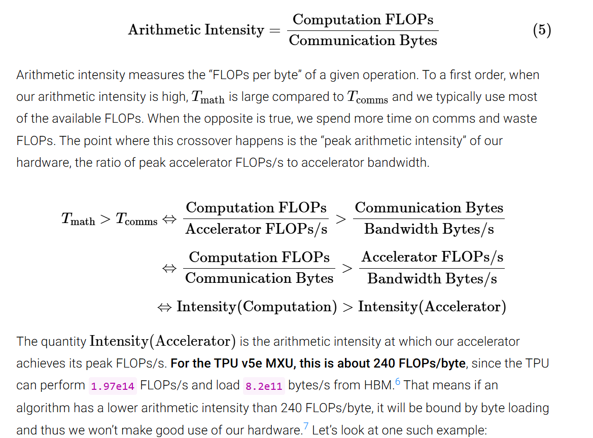

# Lecture 02 · 学习笔记(问题记录与 AI 解答)

- 讲义:仓库根目录 `lecture_02.py`(可执行讲义)
- 本地查看:前端打开 `http://localhost:5173/?trace=var/traces/lecture_02.json`(启动方法见 [README.md](README.md) 第 2 节)
- 状态:进行中(看完后在 [progress.md](progress.md) 更新)
- 用法:看讲时把内容写进 ①~③;然后把本文件路径填入 [README.md](README.md) 第 6 节的 Prompt 发给 AI,AI 会把回答直接写在问题下方并勾选 [x]

> 主题速览:本讲 = **资源账本(resource accounting)**——浮点数值格式、FLOPs/内存怎么数、roofline 判断瓶颈、以及两大省显存技巧。

---

## A. 数值格式(fp32 / fp16 / bf16 / nvfp4)

- [x] **Q1 · fp32 的三段布局:sign / exponent / fraction 分别是什么?各占几位、为何这样设计?**
  > 原问:fp32 的具体含义,其中的 sign、exponent 和 fraction 分别的含义和位数,以及为何这样设计,配合具体例子说明。分别是符号位、指数位和尾数位?
  - 参考 https://zhuanlan.zhihu.com/p/1895850434750576614
  - fp32也被称为float32 或单精度浮点数,是 IEEE 754 标准定义的 32 位浮点数格式。
  - **一句话直觉**:就是二进制的科学计数法——`± 1.xxx × 2^yyy`,一段管正负、一段管"量级跨度"、一段管"精度细度"。
  - **位布局(共 32 bit)**:`sign` 1 位 + `exponent` 8 位 + `fraction(尾数)` 23 位;指数用**偏置编码**(bias=127,存的是 `e+127`),以便比较大小和表示负指数。
  - **数值含义**(normal 情形):$(-1)^s \times (1.\text{fraction})_2 \times 2^{e-127}$,其中 `1.fraction` 是隐式前导 1 加上 23 位小数。
  - **为何这样设计**:sign 处理负数;exponent 用较少位数换取巨大的**动态范围**(fp32 约 $10^{\pm38}$);fraction 决定同一量级内的**分辨率**(约 7 位十进制有效数字)。三者就是科学计数法的三要素。
  - **例子**:`0.5` = $1.0_2 \times 2^{-1}$ → sign=0, exponent 存 `127-1=126`,fraction 全 0;`-12.0` = $-1.5_2\times 2^3$ → sign=1, exponent 存 `127+3=130`,fraction 表示 `0.5`(即二进制 `.1`)。参考:https://en.wikipedia.org/wiki/Single-precision_floating-point_format

  **AI(补充 2026-09-14)· 术语澄清、偏置作用与 fp32 完整范围推导**

  - **尾数与指数到底存的是什么**:
    - **尾数(fraction)**:存储的确实是**二进制小数点后的那串数字**;但对 normal 数而言,真正的有效数字是“**隐式前导 1 + 小数点后 23 位**”=$1.\text{fraction}$(共 24 bit 精度)。前导 1 **不占存储**(省 1 位),这也是公式里写 $(1.\text{fraction})_2$ 而非 $(0.\text{fraction})_2$ 的原因。
    - **指数字段**:本质是一个 **8 位无符号二进制整数** $E\in[0,255]$(用无符号整数的二进制形式存),它与真实指数 $e$ 的关系是 $E=e+127$。
  - **你的理解对不对?——“$2^{e-127}$ 是 E 的二进制减 127 再当指数”**
    - **结论:基本正确**。指数部分是“指数字段 $E$ 减去偏置 127 → 得到整数 $e$(可为负) → 取 $2^e$”。
    - 两个小修正/补充:① **全程可以用整数/二进制直接算**,不必先转十进制(十进制只是给人看的);硬件就是把 8 位字段当成无符号整数,减 127 后解释为有符号指数(范围 $[-126,127]$,故会出现负指数);② **该公式只对 normal 数成立**($1\le E\le254$):$E=0$ 是 **subnormal**(指数固定为 $-126$、且没有隐式前导 1,值是 $0.\text{fraction}\times2^{-126}$);$E=255$ 是 $\pm\infty$/NaN。
  - **偏置(bias=127)的作用,与“到底存了什么”**:
    - 存的是 $E=e+127$(无符号 8 位),**不是 $e$ 本身**。
    - 三个作用:① 不用再给指数配一个符号位——用“整体上移 127”把指数都变成非负,硬件只需处理无符号整数。这里的理解：必须要负数的指数，才能表示小于1的数值;② **单调性**:这样浮点数按**位模式当无符号整数比较**时,顺序与数值大小一致(排序/比较可以复用整数比较逻辑);③ 让可表示的指数范围大致对称($E=127\leftrightarrow e=0$)。
    - 完整存储三块:`sign`(1 bit,0 正 1 负)+ biased exponent(8 bit 无符号)+ fraction(23 bit 小数部分)。
  - **fp32 完整范围推导**(特殊值 0/255 除外):

    | 项 | 位模式条件 | 公式 | 数值 |
    |---|---|---|---|
    | 可表示指数范围 | $E\in[1,254]$ | $e=E-127\in[-126,127]$ | — |
    | **最大有限值** | $E=254$,fraction 全 1 | $(2-2^{-23})\times2^{127}$ | $\approx3.4028\times10^{38}$ |
    | **最小 normal** | $E=1$,fraction 全 0 | $1.0\times2^{-126}$ | $\approx1.1755\times10^{-38}$ |
    | **最小 subnormal(真最小非零)** | $E=0$,fraction 最后一位为1 | $2^{-23}\times2^{-126}=2^{-149}$ | $\approx1.4013\times10^{-45}$ |
    | ±0 | $E=0$,fraction 全 0 | — | 两个位模式 |
    | $\pm\infty$ / NaN | $E=255$ | fraction=0 / ≠0 | — |

    - 所以可表示范围(忽略 NaN/inf):$[-3.4028\times10^{38},\,-1.4\times10^{-45}]\cup\{0\}\cup[1.4\times10^{-45},\,3.4028\times10^{38}]$——注意 $0$ 与最小 subnormal 之间有一段“**下溢间隙**”,这个区间的数只能归零(呼应 Q3 的 fp16 下溢)。
    - **分辨率**:24 bit 有效数字 ≈ $24\log_{10}2\approx7.2$ 位十进制有效数字;在 $x=1$ 附近最小间隔(ulp)=$2^{-23}\approx1.19\times10^{-7}$;能精确表示的连续整数上限 $2^{24}=16{,}777{,}216$。
  - **例 1:把十进制 `732.5` 编成 float32**(逐步):
    1. 转二进制:$732=1011011100_2$、$0.5=0.1_2$ → $732.5=1011011100.1_2$;
    2. 规范化(小数点左移 9 位):$1.\underline{0110111001}_2\times2^{9}$ → 真实指数 $e=9$;
    3. 符号 `s=0`(正数);
    4. 指数字段 $E=9+127=136=10001000_2$;
    5. 尾数字段 = 小数点后的 `0110111001` 后面补 0 到 23 位 = `01101110010000000000000`;
    6. 拼起来(32 bit):`0 10001000 01101110010000000000000` = **`0x44372000`**;
    7. 回验:$(1+0.0110111001_2)\times2^9=1.4306640625\times512=732.5$ ✓(说明 732.5 在 fp32 中**可精确表示**)。
  - **例 2:把 float32 位模式解码回二进制/十进制**(正、负各一例):
    - `0x41C80000` → 二进制 `0 10000011 10010000000000000000000`:sign=0;`10000011`=131 → $e=131-127=4$;fraction=$2^{-1}+2^{-4}=0.5625$ → $(1.5625)\times2^4=$ **`25.0`**;
    - `0xC1400000` → 二进制 `1 10000010 10000000000000000000000`:sign=1(负);`10000010`=130 → $e=3$;fraction=$0.5$ → $-(1.5)\times2^3=$ **`-12.0`**;
    - (附带一个“极小值”)`0x00000001` → $E=0$、subnormal → $2^{-23}\times2^{-126}=2^{-149}\approx1.4\times10^{-45}$,即 fp32 能表示的**最小正数**。
  - **一句话总结**:存储 = `符号 | 偏移后的指数 E=e+127 | 小数点后 23 位`;$e=E-127$ 的差**可为负**;范围由指数位决定($\sim\!\pm3.4\times10^{38}$、最小正数 $\sim\!1.4\times10^{-45}$),精度由尾数位决定(约 7 位十进制)。

  **AI(补充 2026-09-14)· 偏置为什么取 127?$e-127$ 的取值范围?**

  - **先澄清叫法**:偏置(bias)是一个**约定常数,不占任何 bit**;真正写进位模式的是“偏移后的指数字段”$E$。
  - **为什么是 127(推导)**:8 位指数字段能表示无符号整数 $0\sim255$。设计时把两端的 $0$ 和 $255$ 留给特殊用途($E=0$ 给 0 与 subnormal,$E=255$ 给 $\pm\infty$/NaN),中间 $1\sim254$ 共 254 个值给普通数。希望“指数 0”落在正中间,即 $E=127\leftrightarrow e=0$,于是
    $\text{bias}=2^{k-1}-1=2^{7}-1=127\quad(k=8)$
    这就是 IEEE 754 的通用取法:**偏置 = $2^{k-1}-1$**($k$ 为指数字段位数;fp16 的 $k{=}5$ 则为 $2^4-1=15$)。
  - **选取 127 后,$e=E-127$ 的取值范围(你要的答案)**:
    - **最小**:$E=1\Rightarrow e_{\min}=1-127=\boxed{-126}$(对应最小 normal $2^{-126}\approx1.18\times10^{-38}$);
    - **最大**:$E=254\Rightarrow e_{\max}=254-127=\boxed{+127}$(对应最大有限值 $(2-2^{-23})\cdot2^{127}\approx3.40\times10^{38}$);
    - 而 $E=0$ 若按同公式会得 $-127$,但它被保留给 **subnormal**(那里有效指数按 $-126$ 处理、且无隐式前导 1,最小到 $2^{-149}$);$E=255$ 照算会是 $+128$,保留给 $\pm\infty$/NaN。
    - 所以**普通数的指数范围是 $[-126,\,+127]$**(共 254 个指数值)。
  - **为何不取 128?** 若 $\text{bias}=128$,则 $e=0\Rightarrow E=128$,指数范围变成 $[-127,\,+126]$,最大只有 $2^{126}$(≈$1.70\times10^{38}$),比 127 方案的 $2^{127}$(≈$3.40\times10^{38}$)**小一半**。也就是说:**127 把更大的指数留给了正方向**——实践中上溢比下溢更致命,这个微小不对称是有意为之。另外 $127=01111111_2$(“最高位 0、其余全 1”),也让常用值的位模式很有规律。
  - **看指数每 +1、数值翻倍(实例)**:

    | 数值 | 位模式(hex) | 指数字段 $E$ | $E$ 的二进制 | $e=E-127$ | $1.\text{fraction}$ |
    |---|---|---|---|---|---|
    | 0.5 | `0x3F000000` | 126 | 01111110 | −1 | 1.0 |
    | 0.75 | `0x3F400000` | 126 | 01111110 | −1 | 1.5 |
    | **1.0** | **`0x3F800000`** | **127** | **01111111** | **0** | 1.0 |
    | 1.5 | `0x3FC00000` | 127 | 01111111 | 0 | 1.5 |
    | **2.0** | **`0x40000000`** | **128** | **10000000** | **1** | 1.0 |
    | 3.0 | `0x40400000` | 128 | 10000000 | 1 | 1.5 |
    | 最小 normal | `0x00800000` | 1 | 00000001 | −126 | 1.0 |
    | 最大有限值 | `0x7F7FFFFF` | 254 | 11111110 | +127 | 1.111…1 |

    - 规律:$1.0$/`0x3F800000`、$2.0$/`0x40000000`、$0.5$/`0x3F000000` —— 指数每加 1,数值翻倍;而 $1.0$ 的位模式 `0x3F800000` 也是很多实现里“浮点数比较”的常用参考点。
  - **顺带一个“偏置的实用价值”实例**:正因为 $E$ 无符号且单调,浮点位模式当**无符号整数**比较时,正数部分的顺序与数值顺序一致:`0x3F800000`(1.0) < `0x40000000`(2.0) < `0x7F7FFFFF`(max) ✓(负数需另做处理,这是排序/比较库的经典技巧)。
  - **一句话**:偏置取 $2^{k-1}-1=127$ 是为了把“指数 0”摆到中间、并给正指数多留一格;$e=E-127$ 的范围是 $[-126,+127]$($E=0,255$ 另作特殊值)。

- [x] **Q2 · bit / 字节 / KB / MB 等单位的换算**
  > 原问:补充下 bit、字节、kb、mb 等等常用单位的换算关系。
  - 1 字节(Byte, 简称B) = 8 bit;**存储/显存容量**按 2 的幂:1 KB=$2^{10}$=1024 B,1 MB=$2^{20}$≈1.05e6 B,1 GB=$2^{30}$≈1.07e9 B,1 TB=$2^{40}$≈1.10e12 B(硬盘厂商有时按 1000 进制标注,注意区分)。
  - 结合本讲:1 个 fp32 数 = 4 B,1 个 fp16/bf16 数 = 2 B;例:80 GB HBM = $80\times 2^{30}\approx 8.6\times10^{10}$ 字节,bf16 下能放约 43B 个数值。

- [x] **Q3 · 为什么 `1e-8` 在 fp16 下溢成 0?fp16 的表示范围是多少?**
  > 原问:为什么这里对于 1e-8 会出现下溢?是因为 float16 的表示范围有限吗?具体的表示范围是多少?
  - **一句话直觉**:fp16 的指数只有 5 位,最小能表示的非零数约 $6\times10^{-8}$;$1\times10^{-8}$ 比它还小,放不下 → 归零(下溢)。
  - **范围**:fp16 = 1 符号 + 5 指数 + 10 尾数,bias=15。最大值 $(2-2^{-10})\times2^{15}\approx 65504$;最小 normal $2^{-14}\approx6.1\times10^{-5}$;靠 subnormal 可延伸到约 $2^{-24}\approx5.96\times10^{-8}$。
  - **1e-8 为什么失败**:$10^{-8} < 5.96\times10^{-8}$,连 subnormal 都表示不了,硬件 flush 成 0(`assert x == 0` 成立)。
  - **训练中的危害**:梯度或 loss 里的极小量若被冲刷成 0,参数就"不动了",导致不稳定;这也是为什么优化器状态/主权重常用 fp32(见 Q14)。
  - 对比:fp32 指数 8 位,最小 normal 约 $1.2\times10^{-38}$,$1e\text{-}8$ 完全没问题;bf16 与 fp32 同范围,也没问题(见 Q4)。

- [x] **Q4 · bf16 "resolution is worse, but matters less for deep learning" 如何理解?**
  > 原问:bf16 的 The only catch is that the resolution is worse, but this matters less for deep learning.要如何理解?
  - **事实**:bf16 = 1 符号 + **8 指数**(与 fp32 相同)+ 7 尾数,所以**动态范围与 fp32 一致**(不会像 fp16 那样小数下溢/大数上溢),代价是分辨率粗:约 2~3 位十进制有效数字。例:在 $x=1$ 附近,fp16 的最小间隔约 $2^{-10}\approx0.001$,bf16 约 $2^{-7}\approx0.008$——bf16 的"刻度"粗约 8 倍。
  - **为何对 DL 影响小**(两层):① 深度学习对参数量化的"噪声"相当鲁棒,权重/激活的微小舍入误差会被训练中的随机性淹没、且在大量样本上平均掉;② 真正需要高精度的部分(梯度累积、loss、优化器状态)单独用 fp32 兜底(混合精度,见 Q5)。
  - **但"影响小"不等于"没影响"**:数值敏感的算子(exp、softmax、归一化)仍要回 fp32,这正是 Q5 的 AMP 策略。
  - 参考:https://en.wikipedia.org/wiki/Bfloat16_floating-point_format

- [x] **Q5 · AMP "cast into bf16 when safe (matmuls, not exp)" 的原因**
  > 原问:如果计算产生的值可能溢出,那么需要更大的精度表示,对吗?
  - **你的猜测只对了一半**:问题通常**不是"溢出范围"**(bf16 范围比 fp16 还大),而是**"分辨率/数值敏感度"**。
  - 为什么 matmul 安全:矩阵乘法对低分辨率容忍度高——结果由大量乘积累加而来,舍入误差像独立噪声一样被平均掉,且 matmul 占大头,降 bf16 直接**省一半带宽、算力翻倍**。
  - 为什么 exp 等不安全:exp/log/softmax 是"输出对输入非常敏感 + 误差会被放大"的算子(尤其 softmax 要 log-sum-exp 保持数值稳定);bf16 只有约 3 位有效数字,会在这类算子上引入可见误差。
  - 严谨表述(AMP 的做法):把算子分成"可降精度"(matmul、conv 等 memory/compute 密集、误差可平均)与"必须 fp32"(exp、log、softmax、normalization 等),前者走 bf16、后者 fall through。参考 PyTorch AMP 文档(https://pytorch.org/docs/stable/amp.html)与混合精度论文(https://arxiv.org/pdf/1710.03740.pdf)。

- [x] **Q6 · dynamic range 与 resolution 的区别**
  > 原问:dynamic range 是指能表示的数值范围,而 resolution 是指在这个范围内能表示的最小间隔吗?
  - **对,你的理解正确**。两个概念分别由指数位与尾数位决定:
  - **dynamic range**(动态范围)= 能表示的最大与最小非零数之比,≈ 由**指数位数**决定(跨度能到多大);fp16 vs bf16 对比最直观:bf16 因为指数位同 fp32(8 位),范围与 fp32 相同。
  - **resolution**(分辨率)= 同一量级内相邻可表示值的间隔(常称 ulp / machine epsilon),≈ 由**尾数位数**决定;fp16 尾数 10 位比 bf16 的 7 位精细,所以"范围小但更细腻"。
  - 一句话记忆:**exponent 管"能到多远",mantissa 管"刻度多细"**;两者是正交的两个旋钮。

- [x] **Q7 · nvfp4 的可表示值 {0, ±0.5, ±1, ±1.5, ±2, ±3, ±4, ±6} 是怎么来的?**
  > 原问:这里为啥对应的 value 是这些?怎么推导的?
  - **格式**:nvfp4 = **E2M1**(1 符号 + 2 指数 + 1 尾数 = 4 bit → 16 个位模式),指数偏置 **bias = 1**,不保留 inf/NaN。
  - **⚠️ 先纠正一个读表误解**:下面表格右侧两列**不是“尾数的取值”,而是按公式算出来的最终数值**;尾数位 M **只能取 0 或 1**(它就只有 1 个 bit)。你看到的“0、1、2、4”那一列是“**M = 0 时的结果值**”,它们来自**指数部分的刻度**,与尾数无关。
  - **指数部分的刻度 $2^{E-1}$ 怎么来**:bias = 1 意味着真实指数 = (指数字段 $E$) − 1,所以 $E=0,1,2,3$ 对应 $2^{-1},2^{0},2^{1},2^{2}=0.5,1,2,4$。那一列里的 **1、2、4** 就是它($E{=}0$ 那行的 0 是特例,见下)。
  - **两条公式(分 E=0 与 E≥1)**:
    - $E\ge1$(normal):$\text{值}=(-1)^s\times(1+0.5\cdot M)\times 2^{\,E-1}$——有隐式前导 1,尾数位决定取 1.0 还是 1.5 的倍数;
    - $E=0$(subnormal 行):$\text{值}=(-1)^s\times M\times 0.5$——**没有隐式前导 1**,刻度是 0.5,所以 $M{=}0\to0$、$M{=}1\to0.5$(这也解释了为何集合里**没有 0.75**:E2M1 的 subnormal 步长是 0.5 而非 0.25)。
  - **16 个位模式逐一枚举**(每个可表示值到底从哪来):

    | sign $s$ | 指数 $E$(bits) | 尾数 $M$ | 代入公式 | 数值 |
    |:---:|:---:|:---:|---|---:|
    | 0 | 00 | 0 | subnormal: $0\times0.5$ | 0 |
    | 0 | 00 | 1 | subnormal: $1\times0.5$ | 0.5 |
    | 0 | 01 | 0 | $(1+0)\times2^{0}$ | 1.0 |
    | 0 | 01 | 1 | $(1+0.5)\times2^{0}$ | 1.5 |
    | 0 | 10 | 0 | $(1+0)\times2^{1}$ | 2.0 |
    | 0 | 10 | 1 | $(1+0.5)\times2^{1}$ | 3.0 |
    | 0 | 11 | 0 | $(1+0)\times2^{2}$ | 4.0 |
    | 0 | 11 | 1 | $(1+0.5)\times2^{2}$ | 6.0 |
    | 1 | 同上 8 行 | | 取负 | 0, −0.5, −1, −1.5, −2, −3, −4, −6 |

    (注:$s{=}1,E{=}00,M{=}0$ 得到的是 −0,位模式与 +0 不同但数值视为同一个 → **16 个位模式 = 15 个不同实数值**。)
  - **换个角度看正侧是怎么“长”出来的**:
    - 指数每加 1,整行乘 2:$1/1.5\to2/3\to4/6$;
    - 尾数位在每个指数上只提供“1.0 或 1.5”两选一(即 50% 的半档);
    - 于是正侧 $=\{0,0.5\}\cup\{1,1.5\}\cup\{2,3\}\cup\{4,6\}=\{0,0.5,1,1.5,2,3,4,6\}$。
  - **间距/精度**:相邻值间距不均匀($0\sim1$ 区间差 0.5,$2\sim4$ 区间差 1,$4\sim6$ 区间差 2),即“**近似 2 倍几何步长 + 中间插一个 1.5 半分**”;最坏情况下的相对量化误差 ≈ $0.25/1.25=20\%$,相当于每个值只有约 2~3 bit 有效精度。
  - **为什么这么少的裸值还能训模型**:靠 **block scale**——每 **16 个元素共享一个 FP8(E4M3)缩放因子 $s$**,外加 per-tensor 的 FP32 二级缩放,真实值 $x=x_q\times s$。换句话说:**4 bit 负责“块内的相对比例”, $s$ 负责“整块的绝对范围”**;只要块内数值不会跨度太离谱,20% 的相对误差在神经网络里是可容忍的(NVIDIA 报告在许多模型上精度损失很小,具体以其官方 benchmark 为准)。讲义原话:per-block scale 让动态范围变大,但代价是“相邻元素不能各自自由变化”(共享同一刻度)。Nemotron 3 Super 就是用 nvfp4 训练的。参考 NVIDIA 官方博客:https://developer.nvidia.com/blog/introducing-nvfp4-for-efficient-and-accurate-low-precision-inference/

  **AI(补充 2026-09-14)· 微块级缩放(micro-block scaling)详解与算例**

  - **先定义 amax**:$\text{amax}(X)=\max_i|x_i|$——张量里**绝对值最大的那个数**(符号位单独处理,所以比较的是幅值)。块级别的 $\text{amax}(b)$ 就是该块 16 个元素里绝对值最大的那个。
  - **要解决的问题**:4 bit 的 E2M1 只有 15 个档位(可表示的幅值就是 $0,0.5,1,1.5,2,3,4,6$),必须先用一个“刻度”(scale)把真实数值映射进去。若**整张量只用一个刻度**,用哪个值算?——用 $\text{amax}$:**$s=\text{amax}/6$**。
  - **为什么除以 6**:$6$ 是 E2M1 能表示的最大幅值。除以 6 的含义是“**让张量里最大的那个数正好落在最高档 6 上**”——既用满量程,又不会溢出(若取 $s=\text{amax}/4$,最大值只用到档位 4,剩下 6 这档的分辨率被浪费;若取 $s=\text{amax}/7$,最大值算出 7 > 6 会被截断)。所以
    $s=\frac{\text{amax}}{6}\quad\Longleftrightarrow\quad \text{真实值}=\text{档位}\times s$
    也就是**刻度 $s$ 就是“档位 1 代表多少真实数值”**。
  - **量化/反量化三步**:① 真实值 ÷ $s$ → 得到“档位数字”;② 四舍五入到最近的 E2M1 档位;③ 乘回 $s$ 得到近似值。
  - **对照表($s=\text{amax}/6=166.7$ 时每个档位代表多少真实值)**:

    | 档位 | 0 | 0.5 | 1 | 1.5 | 2 | 3 | 4 | 6 |
    |---|---|---|---|---|---|---|---|---|
    | 真实值 | 0 | 83.3 | 166.7 | 250 | 333.3 | 500 | 666.7 | 1000 |

  - **反面算例逐步算**:张量 $\text{amax}=1000$ → $s=1000/6\approx166.7$;现在有一个真实值 **0.3**:
    1. $0.3/166.7\approx0.0018$——它只相当于 **0.0018 个档位**;
    2. 最近的档位是 **0**(离最近的 0.5 还差 0.498);
    3. 反量化 $0\times166.7=0$ → **0.3 变成了 0,信息彻底丢失**。
    - 等价的直观判据:量化前 $|x|<\tfrac{0.5}{2}\cdot s=0.25s$ 的值,四舍五入后都是 0 档——本例即 **$|x|<41.7$ 的数值全部变成 0**。一个 outlier(1000)就把整张量的刻度撑大,导致所有小值集体归零——这就是必须**分块**(每块用自己的 $\text{amax}$)的动机。
  - **解决思路:分块,让每块用自己的刻度**。把张量按**每 16 个连续元素**切成微块(micro-block;通常沿内维/K 维切),每块独立算刻度 → 小值所在的块有自己的小刻度,保住了分辨率;outlier 只影响它自己所在的那一块。这就是“块越小越贴合局部分布”的原因,也是 NVFP4 把块从 MXFP4 的 **32** 缩到 **16** 的动机。
  - **“沿内维/K 维切”到底是什么意思?(具体例子)** 拿一个权重矩阵为例:
    - 设 $W$ 形状为 $[4,\ 32]$(4 个输出神经元 × 32 个输入特征;$K$ = 内维 = 32)。**沿最后一维(K 维)按 16 个一组切**,每行就被切成 2 段,整张量共 $4\times2=8$ 个微块:

      ```text
      W (4×32)                         
      行1: [ a a a ... a | a a a ... a ]   ← 前16个 = 块(1,1),后16个 = 块(1,2)
      行2: [ b b b ... b | b b b ... b ]   ← 块(2,1),块(2,2)
      行3: [ c c c ... c | c c c ... c ]   ← 块(3,1),块(3,2)
      行4: [ d d d ... d | d d d ... d ]   ← 块(4,1),块(4,2)
      ```
    - 每个块**自己算自己的刻度** $s=\text{amax(这 16 个数)}/6$。例如:
      - 行1 的前 16 个数都在 ±0.9 以内 → 块刻度 $s_{(1,1)}=0.9/6=0.15$;
      - 行1 的后 16 个数里有一个 outlier 5.0 → 块刻度 $s_{(1,2)}=5.0/6\approx0.833$。
      - 同一行、两个块、两个刻度——这就是“**各自用自己的尺子量**”:outlier 只把它自己那块(后 16 个数)的尺子撑大,不会影响前 16 个数。
    - 存储上:除了 4-bit 的值,还要额外存一个**刻度张量**,形状 $[4,2]$(每块一个),每个刻度用 **E4M3(8 bit)**存。
    - **为什么沿 K/内维切而不是随便切**:① 矩阵乘 $Y=XW$ 里每个输出元素是一次沿 $K$ 的内积;$K$ 方向分组后,硬件可以先把 4-bit 值累加、最后再乘刻度(每个 $x_q w_q$ 共享同样的两个刻度因子),实现简单;② “连续的 16 个”= 相邻通道,它们在神经网络里尺度相近、相关性强,适合共享一把尺子;③ 连续内存 → 访存高效。
    - **为什么是 16**:与 Tensor Core 的 FP4 分组粒度对齐(2 的幂、硬件友好);块越小越贴合局部分布,但刻度开销越大:$16\to 8\text{ bit}/16 = 0.5$ bit/值;$32\to 0.25$ bit/值。
  - **每块的“总刻度”其实很简单**:$\text{总刻度}=\text{amax(块)}/6$($6$ 是 E2M1 能表示的最大幅值)。难点在**怎么存这个刻度**:若每块存一个 FP32 刻度,16 个 4-bit 值(8 B)就要配 4 B 刻度,开销 50%,太贵。于是 NVFP4 用**两级缩放**把它拆开:
    1. **一级:每块一个 FP8(E4M3)刻度 $s_b$** —— 只占 8 bit;E4M3 = 1 符号 + 4 指数 + 3 尾数,能表示**非 2 的幂**的刻度,拟合更细(官方数据:刻度编码 MSE,$\text{E8M0}=0.72$ vs $\text{E4M3}=0.08$);
    2. **二级:每张量一个 FP32 刻度 $s_g$** —— 只占 32 bit/张量(摊销后可忽略);因为 E4M3 动态范围窄(最大 448,最小 normal 约 $2^{-6}\approx0.0156$),先用它把整张量归一化,使**各块的刻度都落在 E4M3 能表示的区间**,再由 $s_b$ 记录块间相对差异。
  - **术语对照(四个名字最容易混)**：

    | 名字 | 位宽/构成 | 在 NVFP4 里的角色 | 备注 |
    |---|---|---|---|
    | E2M1 | 4 bit(1 符号+2 指数+1 尾数) | **数据本身**(那 15 个档位) | 最大幅值 6 |
    | E4M3 | 8 bit(1 符号+4 指数+3 尾数) | **一级:块刻度** $s_b$ | 最大 448;带尾数→刻度不限于 2 的幂 |
    | FP32(E8M23) | 32 bit(1+8+23) | **二级:张量刻度** $s_g$ | 就是普通 float32 |
    | E8M0 | 8 bit(**只有指数,无尾数**) | **MXFP4 的块刻度**(NVFP4 不用) | 只能表示 $2^n$,范围 $2^{\pm127}$ |

    - 所以 **“FP32” 不是 “E8M0”**：E8M0 是“另一种 8-bit 的**块刻度**格式”(MXFP4 用)，FP32 是 NVFP4 的**第二级(张量级)刻度**。正文那句“最大 448，远不如 E8M0 的 $2^{\pm127}$”是在对比两种**块刻度格式**(E4M3 vs E8M0)的表示范围。
  - **两级刻度到底解决什么(两个目的)**：① **省存储**：每块的“总刻度”若直接存 FP32，16 个 4-bit 值(8 B)要配 4 B 刻度(50% 开销)；拆开后每块只存 8 bit(0.5 bit/值)，只剩一个 FP32 由整个张量分摊。② **适配 E4M3 的窄范围**：块刻度的绝对值可能横跨好几个数量级(有的块 $10^{-3}$、有的块 $10^{2}$)，E4M3 装不下；先用 $s_g$ “把整张量缩放到合适量级”，$s_b$ 就只需记录块间的**相对比例**(通常在几个数量级内)，8 bit 足够。
  - **刻度(scale)到底是什么**：刻度就是“**档位 1 代表多少真实数值**”的换算因子，满足 $\text{真实值}=\text{档位}\times\text{刻度}$。你说得对：$0.9/6=0.15$ 就是那一块的刻度——它意味着“这个块里，4-bit 的每一档代表 0.15”，于是最高档 $6\times0.15=0.9$ 正好等于块内最大幅值。在 NVFP4 里，这个“块的总刻度”并不是直接存下来的，而是被拆成 $s_g\times s_b$ 两个因子来存(乘起来才等于它)。
  - **用同一个 $4\times32$ 矩阵续算(把两级刻度走一遍)**：设整张量 $\text{amax}_{\text{tensor}}=5.0$(就是块(1,2)里那个 outlier)：
    1. 全局(张量)刻度：$s_g=\dfrac{5.0}{6\times448}=\dfrac{5.0}{2688}\approx0.00186$；
    2. 块(1,2)(amax=5.0)的块刻度：$s_b=\text{E4M3}\!\left(\dfrac{5.0}{6\times0.00186}\right)=\text{E4M3}(448)=448$ —— 正好是 E4M3 的最大值(**这就是 $s_g$ 里那个 448 的来历**：让“最大块的刻度”恰好用满 E4M3)；
    3. 块(1,1)(amax=0.9)的块刻度：$s_b=\text{E4M3}\!\left(\dfrac{0.9}{6\times0.00186}\right)=\text{E4M3}(80.6)\approx80$(E4M3 只有 3 位尾数，80 附近的步长是 8：…64, 72, 80, 88…)；
    4. 反量化时把两个因子乘回来：块(1,2) $448\times0.00186\approx0.833=5/6$ ✓；块(1,1) $80\times0.00186\approx0.149\approx0.9/6$ ✓(与 E4M3 舍入差一点点)；
    5. 验证一个小值：块(1,1)里的真实值 0.3 → $0.3/0.149\approx2.01$ → 最近的 E2M1 档位是 2 → $\hat x=2\times0.149=0.298$(误差 ≈0.8%)✓；而若不分块、全张量共用一个刻度 $5/6\approx0.833$：$0.3/0.833\approx0.36$ → 落到档位 0.5 → $\hat x=0.417$(误差 39%)——同一个数，分块把它从“糊掉”变成“几乎精确”。
  - **流程与公式**(常见文献/实现口径——官方博客只写明了“$x=x_q\times s$ + per-tensor FP32 二级 scale”的结构,以下逐步公式取自 NVIDIA Transformer Engine / arXiv 2503.02450 等公开资料;clamp/rounding 细节以实现为准):
    设块 $b=\{x_1,\dots,x_{16}\}$,$\text{amax}(b)=\max_i|x_i|$,$\text{amax}_{\text{tensor}}=\max_b\text{amax}(b)$;$6$=E2M1 最大幅值,$448$=E4M3 最大幅值。
    1. 全局刻度:$s_g=\dfrac{\text{amax}_{\text{tensor}}}{6\times448}$
    2. 块刻度(量化到 E4M3):$s_b=\text{E4M3}\!\left(\dfrac{\text{amax}(b)}{6\,s_g}\right)$
    3. 量化:$q_i=\text{E2M1}\!\left(\dfrac{x_i}{s_g\,s_b}\right)$
    4. 反量化:$\hat x_i=q_i\cdot s_b\cdot s_g$
    - **好用的等价视角**:复合刻度 $s_g s_b=\text{amax}(b)/6$(就是每块的“总刻度”);两级拆分只是为了“把总量级交给 FP32、把块间差异交给 8 bit 的 E4M3”。
  - **算例 1(分块 vs 不分块,同一段小数值)**:
    - 张量 $\text{amax}=1000$,某块 16 个值都在 $0.1\sim0.5$。
    - **不分块**:$s=1000/6\approx166.7$;$0.3\to0.3/166.7\approx0.0018\to$ 最接近的 E2M1 是 0 → **整块归零** ✗;
    - **NVFP4 两级**:$s_g=1000/(6\times448)\approx0.372$;该块 $s_b=\text{E4M3}(0.5/(6\times0.372))=\text{E4M3}(0.224)\approx0.224$;复合刻度 $=0.224\times0.372\approx0.0833(=0.5/6)$;于是 $0.3/0.0833\approx3.6\to$ 最近的 E2M1 是 4 → $\hat x=4\times0.0833\approx0.333$(相对误差 ≈11%)✓ 保住了。
  - **算例 2(outlier 的代价 —— 为什么块要小)**:
    - 另一块里 15 个值 ≈1、1 个 outlier = 1000;该块 $\text{amax}=1000$ → 复合刻度 $=1000/6\approx166.7$;$1\to1/166.7\approx0.006\to0$ → **同块的 15 个小值被 outlier 拖累成 0**。
    - 结论:outlier 的影响被限制在**它所在的 16 个元素**内(块越小影响面越小,代价是 scale 存储开销上升:$16\to0.5$ bit/值,$32\to0.25$ bit/值)。
  - **算例 3(块内“远小于 amax”的值相对误差大)**:块 $\text{amax}=5$ → 复合刻度 $5/6\approx0.833$;$3.7\to4.44\to4\to3.33$(误差 ≈11%);$0.3\to0.36\to0.5\to0.417$(误差 ≈39%)。这正是 4 bit 的固有代价,靠“训练时误差被平均/模型对量化噪声鲁棒”来吸收。
  - **存储开销(官方数字)**:每 16 个值 = $16\times4=64$ bit 的值 + $8$ bit 的 E4M3 scale = $72$ bit → **4.5 bit/值**(官方原话);再加 per-tensor FP32(摊销后可忽略);相对 FP16 小约 3.5×、相对 FP8 小约 1.8×。
  - **为什么块内共享可行 / 代价是什么**:神经网络权重与激活在**局部(相邻通道/相邻位置)尺度相近、相关性强**,跨整张量的动态范围才是主要矛盾;块内共享刻度让每块只需 8 bit 的 scale,代价是**块内元素不能各自自由缩放**(讲义原话“can't vary freely from neighbors”),且矩阵乘前需要先乘上 scale——Blackwell 第五代 Tensor Core 把这套“分组 + 动态缩放 + 4-bit 矩阵乘”做进硬件,对开发者基本透明。
  - **效果数据(官方博客)**:DeepSeek-R1-0528 从 FP8 量化到 NVFP4(PTQ),7 项评测精度下降 ≤1%(AIME 2024 反而 +2%);Nemotron 3 Super 用 NVFP4 训练(讲义 line 179)。
  - **一句话总结**:**4 bit 管“块内相对比例”、E4M3 的 $s_b$ 管“块间差异”、FP32 的 $s_g$ 管“整张量的量级”**——三级预算各司其职,换来 4.5 bit/值 的存储。

---

## B. 计算与内存账本(FLOPs / MFU / roofline / 训练开销)

- [x] **Q8 · 矩阵乘 $B\times D$ @ $D\times K$ 的 FLOPs = $2BDK$ 的推导**
  > 原问:能否理解为:每个元素需要 2*D 次运算,生成的矩阵有 B*K 个元素,所以总 FLOPs = B*K*D*2?
  - **你的理解完全正确**。设 $Y_{i,k}=\sum_{j=1}^{D}X_{i,j}W_{j,k}$:每个输出元素做 $D$ 次乘法 + $D$ 次加法(累加)= $2D$ 次浮点运算;输出共有 $B\times K$ 个元素 → 总 $2BDK$。
  - 补充:这是"一次乘加记 2 FLOPs"的计数约定(讲义 313-314 行同款),也是前面 $6ND$ 公式里"2"的来源之一。
  - 讲义(可用 trace 复跑):`y = x @ w` 计时 + `actual_num_flops = 2*B*D*K`。

- [x] **Q9 · MFU 的分子/分母含义,以及"promised"和"actual"各自怎么来**
  > 原问:promised_flop_per_sec 是指理论上硬件能达到的最大 FLOP/s 吗?actual 是实际测量到的吗?它们分别如何计算/测量?
  - **MFU = actual FLOP/s ÷ promised FLOP/s**,衡量"硬件算力被用到了几成"(忽略通信/开销)。
  - **promised(理论峰值)**:来自硬件规格表(datasheet)上**对应数据类型**的峰值——注意它强依赖 dtype!如 H100:bf16/fp16 **dense** = 1979/2 = 989.5 TFLOPS(1979 是开稀疏的数值,讲义取 dense 一半);fp32 则只有 67.5 TFLOPS(见 `get_promised_flop_per_sec`,A100/B200 同理查表)。
  - **actual(实测)**:选一个你知道确切 FLOPs 的操作(如 matmul = 2BDK),跑 `benchmark()`(带 `torch.cuda.synchronize()` 的计时)得到秒数,FLOPs÷秒即 actual FLOP/s。
  - **为什么 MFU 到不了 1**:roofline 视角下 MFU ≈ $\min(1,\ \text{arithmetic intensity}/\text{accelerator intensity})$——当算力吃不满时(如 memory-bound 或调度/占用率不足)就低于 1;≥0.5 已经算相当好(讲义原话)。
  - 参考 roofline 详解（很好的说明耗时/compute or memory-bound的材料）:https://jax-ml.github.io/scaling-book/roofline/

  - roofline中这块的解释：最下方的不等式左侧代表实际的算力利用率（即arithmetic intensity），右侧代表理论上硬件能达到的最大算力。若实际算力利用率低于理论峰值，则说明存在瓶颈，可能是内存带宽不足或计算资源未充分利用。右侧的Intensity(Accelerator) 在给定硬件条件下是固定的，而左侧的Intensity(Arithmetic) 则取决于具体的计算任务和数据访问模式。通过比较两者，可以判断当前计算任务是否受限于内存带宽或计算能力，从而优化代码或调整硬件配置以提高性能。
  - **AI(补充 2026-09-18)· MFU 与 scalability 的关系;scaling book 里有吗?**
    - **先分清两种 “scaling”**:① **系统意义的 scaling(强扩展 strong scaling)**:增加芯片数时能否保持吞吐线性增长、MFU 不塌——这是 scaling book 的核心目标(Part 0 原文:目标是“增加芯片数时实现吞吐的线性增长”);② **算法意义的 scaling(scaling law)**:loss 随算力/数据/参数如何下降。**MFU 不改变 loss-vs-C 曲线,它决定你实际能买到多少 C。**
    - **MFU 到底是什么(把公式写成“训练级”版本,就好懂了)**:
      $\text{MFU}=\frac{\text{模型真正完成的 FLOPs}}{\text{墙钟时间}\times\text{卡数}\times\text{每卡峰值 FLOP/s}}$
      - **分子**=模型“有用”的工作量(按 $6ND$ 之类算出的理论 FLOPs);**分母**=你为这段时间买的“理论最大算力”(卡数 × 单卡峰值 × 实际耗时)。
      - 所以 MFU = “**你买的算力里,有多少真正变成了模型的 FLOPs**”。分母里的“卡数 × 单卡峰值”是**标称值**(不会因为你通信卡住而变小),但墙钟时间会因通信/气泡/等待变长 → 同样的工作量花了更长时间 → **MFU 下降**。这就是“并行开销体现在 MFU 里”的含义。
    - **把端到端 MFU 拆成两个折扣(这就是那句“单卡看 roofline、多卡看掉多少”)**:
      $\text{MFU}\ \approx\ \underbrace{\min(1,\text{AI}/\text{AccI})}_{\text{① 单卡效率(roofline 上限)}}\ \times\ \underbrace{\frac{\text{理想时间}}{\text{实际时间}}}_{\text{② 并行效率}}$
      - **① 单卡效率**:只有一张卡时没有通信,MFU 上限完全由 roofline 决定——batch 够大、矩阵够大、算子是 compute-bound 才能接近峰值;逐元素算子、小 batch、长上下文 decode 都会把它拉低。
      - **② 并行效率**:理想时间/实际时间 = 加速比达成度;拿不到的份额就是通信、流水线气泡、all-reduce 等待、同步开销。
      - 两个折扣的**修法完全不同**——①差就加大 batch/矩阵、fuse kernel、换 dtype;②差就调并行策略、减少通信频率(梯度累积)、做通信-计算重叠、换更快互联。这就是要拆开看的原因。
    - **一个具体数字例子(8 卡,每卡峰值取 $10^{15}$ FLOP/s 方便算)**:
      - 一次迭代的“有用”工作量 $W=1.6\times10^{14}$ FLOPs;
      - **理想情况**(单卡跑满 + 8 卡零开销):$t_{\text{ideal}}=\dfrac{1.6\times10^{14}}{8\times10^{15}}=20\ \text{ms}$;
      - 但实测单卡其实只能跑到峰值的 70%(roofline 限制)→ 单卡需 $160/0.7\approx228.6$ ms → 8 卡理想 $228.6/8\approx28.6$ ms;
      - 实测端到端 $40$ ms → ② 并行效率 $=28.6/40\approx71\%$;
      - 端到端 $\text{MFU}=\dfrac{1.6\times10^{14}}{40\text{ms}\times8\times10^{15}}=0.5$，而 $①\times②=0.7\times0.71\approx0.5$ ✓——两种算法完全一致。
    - **AI(补充 2026-09-18)· roofline 的定义,以及“为什么单卡只能到峰值的 70%”**
      - **roofline 是什么**:一个“性能上限”模型/图。横轴 = 算法的 **arithmetic intensity**:$\text{AI}=\dfrac{\text{FLOPs}}{\text{需要搬运的字节数}}$;纵轴 = 实际可达性能(FLOP/s)。它由两条“屋顶线”构成:
        - **带宽线(斜线)**:性能 $\le \text{AI}\times\text{带宽}$;
        - **算力线(水平线)**:性能 $\le$ 峰值 FLOP/s。
        - 合起来:$\text{可达性能}=\min\big(\text{峰值 FLOP/s},\ \text{AI}\times\text{带宽}\big)$。
      - **拐点 = accelerator intensity**:$\text{AccI}=\dfrac{\text{峰值 FLOP/s}}{\text{带宽}}$,即“达到峰值所需的最低 AI”。
        - 判据:$\text{AI}<\text{AccI}\Rightarrow$ **memory-bound**(撞带宽墙,算力用不满);$\text{AI}>\text{AccI}\Rightarrow$ **compute-bound**(理论上可接近峰值)。
        - 写成 MFU 上限:$\text{MFU}\le\min\big(1,\ \text{AI}/\text{AccI}\big)$。
      - **代入 H100 数字**:bf16 峰值(稠密) $9.895\times10^{14}$ FLOP/s、HBM 带宽 $3.35\times10^{12}$ B/s $\Rightarrow \text{AccI}\approx295$ FLOP/字节。

        | 算子 | AI(FLOP/字节) | MFU 上限 = AI/295 |
        |---|---|---|
        | ReLU | ≈0.25 | ≈0.08% |
        | GeLU | ≈5 | ≈1.7% |
        | 点积 | ≈0.5 | ≈0.17% |
        | 大矩阵乘($n{=}1024$) | ≈341 | 100%(compute-bound) |

      - **所以那个“70%”不是硬件坏了,而是 workload 的 AI 不够**:若某算子/某段 workload 的 $\text{AI}/\text{AccI}\approx0.7$,它在 roofline 上就撞在带宽斜线上,上限只能是峰值的 70%——**要再往上,唯一办法是把 AI 提上去**(fuse kernel、tiling/FlashAttention 提高片上复用、加大 batch/矩阵)或把带宽提上去。
      - **为什么真实训练端到端 MFU 常只有 30~60%**:一次训练是成百上千个算子的混合——其中大量是 memory-bound 的(softmax、LayerNorm、激活、残差加法、优化器逐元素更新),它们把按时间加权的整体 MFU 拉低;再加上小 batch 的 matmul 达不到 compute-bound、通信未完全重叠、kernel 启动/尾部效应等。所以 MFU 是“整段工作的加权平均上限”,而不是单个大矩阵乘的巅峰值。
      - 相关:Q11/Q12 已算过这些 AI 的具体数(ReLU 0.25、GeLU 5、点积 0.5、matmul $n/3$);scaling book Part 1 是这套内容的系统讲解(含 batch 临界值)。
    - **为什么“卡数翻倍、模型/批量也翻倍时,MFU 不变 = 强扩展好”**:这正是“线性扩展”的等价说法——工作量翻倍、卡数翻倍,若时间不变,则
      $\text{MFU}=\dfrac{2W}{t\times16\times P}=\dfrac{W}{t\times8\times P}$(与之前相同);反之若时间从 40 ms 变成 60 ms(而不是保持 40 ms),MFU 就从 0.5 掉到 0.33——**掉的那部分正是通信/气泡/等待吃掉的**。所以“强扩展好不好”最终就变成一个可测的数:**MFU 随卡数下降的斜率**。
    - **哪些东西会拉低 MFU(也就是“scalability 差”的来源)**:
      - **batch 太小**:matmul 的算术强度 $\approx B$($B\ll D,F$ 时);bf16 要 compute-bound 需 **batch > ~240 tokens(TPU v5e)/ ≈295(H100)**(scaling book roofline 练习题的结论;这里的 batch 是**每份权重副本**对应的 token 数,不是序列数)。这就是“大 batch / 梯度累积能提 MFU”的原理;
      - **矩阵/tile 太小**:scaling book 例:$D{=}F{=}4096$ 与 $1024$ 最终都能到峰值,但小维度需要**更大的 batch**才达标;
      - **跨芯片分片**:阈值从“看 $B$”变成“看 $D$”——例:2 路分片、每方向 4.5e10 B/s 时需 $D>8755$ 才能 compute-bound;分得不好就是 communication-bound,MFU 掉;
      - **并行策略与通信**:TP(每层 all-reduce)、PP(流水线气泡)、EP(all-to-all),以及通信-计算重叠做得好不好;
      - **模型形态**:长上下文(prefill 的 AI 高、decode 的 AI 差,见 Lecture 03 P58/P60)、MoE、过深的流水线——**架构本身决定了它在多大集群上还能保持高 MFU**。
    - **MFU 与 scaling law 的衔接(为什么“系统效率”也是降 loss 的手段)**:训练墙钟时间 $\approx \dfrac{C_{\text{total}}}{\text{峰值 FLOP/s}\times\text{MFU}\times\text{卡数}}$,成本 ∝ 时间×卡数;scaling law 告诉你“给定 C 能到多少 loss”,MFU 决定“给定钱/时间能买到多少 C”——两者正交,提高 MFU = 同样预算下把 C 推大(对应讲义 bitter lesson 的 accuracy = efficiency × resources)。⚠️ 注意口径:scaling law 的 C 通常按 $6ND$ 的**理论 FLOPs** 算,而 MFU 是实际墙钟效率——不同规模/上下文下 MFU 不同,所以“FLOPs 预算”与“真实成本”会脱钩(Lecture 02 的 “FLOPs are not runtime!” 与 Lecture 03 的 P58/P60 是同一个道理)。
    - **scaling book 有介绍吗?(已核实)**
      - **没有直接以 “MFU” 之名介绍**:总目录页与 Part 1 Roofline 页都**没有出现 MFU / Model FLOPs Utilization 这个词**;它用的是 **arithmetic intensity / accelerator intensity、strong scaling、communication-bound、roofline efficiency、perf/$** 这套语言。
      - 但它把 MFU 的**两个决定因素**讲透了:
        - **单芯片(Part 1 Roofline)**:AI vs AccI;$T_{\text{lower}}=\max(T_{\text{math}},T_{\text{comms}})$、$T_{\text{upper}}=T_{\text{math}}+T_{\text{comms}}$(上下界最多差 2 倍);batch/tile 临界值公式与练习题;多芯片时阈值改由 $D$ 决定。
        - **多芯片(Part 5 Training)**:目标就是 strong scaling;数据/张量/流水/专家并行怎么选、内存技巧(rematerialization / ZeRO / offload / gradient accumulation)——也就是“**如何不牺牲 MFU 地扩展**”。
      - 所以准确说法:**“MFU”这个术语来自 CS336 讲义(Lecture 02 给了 actual/promised 的定义与 $\text{MFU}=\min(1,\text{AI}/\text{AccI})$);而 scaling book 提供的是“MFU 的理论上限 + 它为何随规模下降”的分析框架。** 两边一起看最完整:讲义给指标,书给机理。参考:https://jax-ml.github.io/scaling-book/roofline/ 与 https://jax-ml.github.io/scaling-book/training/
- [x] **Q10 · 通信与计算完美重叠时 $total = \max(\text{comm},\ \text{compute})$**
  > 原问:两者会同时运行吗?总时间就是较长的那个,对吗?
  - **对**。若通信(数据搬运)与计算能在不同硬件资源上**完全并行**(如 NVLink/拷贝引擎搬数据的同时 SM 在算),总墙钟时间 = 两者中较长者;谁长谁是瓶颈。
  - 直觉:水管注水(算)与搬桶(传)同时进行,总时长取决于"算完"和"传完"哪个更晚。
  - 严谨补一句:**现实里重叠通常不完美**,总时间落在 $\max$ 与 $sum$ 之间;公式 `max` 是"完美重叠"的理想上界/下界情形,讲义用它是为了先把概念讲清楚(后面并行单元会算真实重叠效率)。

- [x] **Q11 · ReLU 的 bytes 与 FLOPs 怎么数**(arithmetic_intensity_relu)
  > 原问:bytes = 读 x 2n + 写 y 2n = 4n,对吗?flops = n 次与 0 比较,对吗?bytes/flops 的含义分别是什么?
  - **bytes**:读入 $x$ 的 $n$ 个 bf16($2n$ 字节)+ 写出 $y$ 的 $n$ 个 bf16($2n$ 字节)= $4n$ 字节,**对**(讲义代码 `(2*n)+(2*n)`)。
  - **FLOPs**:每个元素做 1 次与 0 的比较 → $n$ 次,**对**。
  - 小修正(诚实声明):ReLU 的比较严格说不是"浮点运算",但资源账本把它按"每元素 1 次单位运算"计,讲义也如此近似($n$ 与 $2n,4n$ 比只是量级估计),不影响 memory-bound 结论。
  - **两概念**:bytes = 必须搬运的数据量(决定 memory 时间),flops = 必须执行的运算量(决定 compute 时间);二者比值 = arithmetic intensity(见 Q12)。
  - 结论:ReLU 的 arithmetic intensity ≈ $n/(4n)=0.25$ FLOP/B,远小于 H100 的 accelerator intensity(≈989.5e12/3.35e12≈295 FLOP/B)→ **memory-bound**。

- [x] **Q12 · bytes 与 flops 的语义确认**
  > 原问:bytes 是在计算过程中需要传输的数据量,flops 是需要进行的浮点运算次数?
  - **对**。资源账本的基本量:FLOPs(要做多少运算)→ 算力时间 = FLOPs ÷ (FLOP/s);bytes(要搬多少数据)→ 带宽时间 = bytes ÷ (bytes/s);两者之比 = arithmetic intensity(每搬 1 字节能干多少 FLOP),拿来和硬件 accelerator intensity 比,判断 memory-bound 还是 compute-bound。roofline 图就是把"每个算子"画成"强度 vs 速度"的点,看它落在带宽斜坡还是算力平台(讲义 roofline_plots + scaling-book 参考)。

- [x] **Q13 · backward 两个 einsum 的 FLOPs 推导 + "反向 2 倍于前向"**
  > 原问:详细解释 h1_grad / w2_grad 的 einsum 与 num_backward_flops,为什么 backward 是 forward 的 2 倍?
  - 记第 2 层 $h_2 = h_1 @ w_2$($h_1$: B×D,$w_2$: D×D)。前向一个 matmul = $2BDD$ FLOPs(讲义 529 行)。
  - **反向要算两类梯度**(讲义 537-543 行),各是一次同量级 matmul:
    - $h_1.\text{grad} = h_2.\text{grad}@w_2^{\top}$:einsum `"batch out, in out -> batch in"`,输出 B×D,每个输出对 out 求和 D 项 → $2BDD$;
    - $w_2.\text{grad} = h_1^{\top}@h_2.\text{grad}$:einsum `"batch out, batch in -> in out"`,输出 D×D,每个对 batch 求和 B 项 → $2BDD$;
    - 合计 $4BDD = 2\times$ 前向 ✓(讲义 543 行的 `(2*B*D*D)+(2*B*D*D)`)。
  - **澄清你的猜测**:反向 2 倍**不是因为"对 w 和 b 两个参数算梯度"**(bias 只是小项),而是因为反向必须同时产出**"给上一层回传的激活梯度"**和**"本层权重梯度"**——每层都要两个与 forward 同量级的矩阵乘。每层都如此 → 整网 backward ≈ 2×forward。
  - 延伸:这也是 $6ND$(前向 2 + 反向 4)公式里 4 的来源(见 Q15)。

- [x] **Q14 · 训练内存四件套:$total = params + activations + gradients + optimizer\ state$**
  > 原问:这个公式如何理解?
  - 训练一轮需要同时存活的四类张量(讲义 646 行):
    - **参数 parameters**:模型权重(bf16 下 2 B/参数);
    - **激活 activations**:前向各层的中间结果(反向算梯度要用),大小 ∝ batch × 序列长 × 隐藏维 × 层数,与 batch/seq 强相关;
    - **梯度 gradients**:反向产出的 $\partial L/\partial\theta$(bf16 下 2 B/参数);
    - **优化器状态 optimizer state**:Adam 要保存一阶矩 m + 二阶矩 v,惯例用 fp32 保稳 → 4+4 = 8 B/参数(AdaGrad 只存二阶矩 → 4 B/参数)。
  - 拿讲义 napkin 算一遍(79-83 行):bf16 训练 + AdamW,每参数 $2+2+8=12$ B → 8×80 GB ÷ 12 B/参数 ≈ 530 亿参数上限(还没算激活,故只是上界)。
  - 要点:参数量大了以后,**优化器状态常是内存大头**;激活则随 batch 线性涨——这直接引出 Q16/Q17 两个省显存技巧。

- [x] **Q15 · "前向 2、反向 4、合计 6 次运算/参数/数据点" 的推导**
  > 原问:backward 的 flops 是 forward 的 2 倍吗,是不是因为 backward 需要对 w 和 b 两个参数都计算梯度?
  - **是 2 倍,但不是因为 w/b 两个参数**(与 Q13 同因):每层反向要算"回传梯度 + 权重梯度"两个同量级 matmul → 每层 backward = 2×forward;全网络加总 → backward ≈ 2×forward。
  - 逐数据点逐参数看:forward 每个参数被乘一次并累加一次 ≈ 2 FLOPs;backward 每个参数平均 ≈ 4 FLOPs(2 用于算权重梯度、2 用于把误差往前传);合计 **6 FLOPs/参数/数据点**,即 $6\times B\times N$(训练一个 epoch/token 数版本就是 $6ND$)。
  - 这是对 MLP 的精确结果,对 Transformer(短上下文)是很好的近似;attention、logits 层、embedding 等二阶项在 Assignment 1 里会精确逐层数。
  - 参考:https://www.adamcasson.com/posts/transformer-flops(Transformer 版逐层 FLOPs)

- [x] **Q16 · gradient accumulation:是什么、为什么**
  > 原问:batch 太大显存不够,就拆 micro-batch 算梯度累加、再更新参数,对吗?目的是啥?
  - **机制对**(讲义 718-730 行):把大 batch 拆成 $K$ 个 micro-batch,逐个前向+反向得到梯度,`grad` **累加不清零**;每 $K$ 个 micro-batch 才做一次 `optimizer.step()` 并清零。
  - **目的**:① **用更小显存模拟更大的有效 batch**(激活内存 ∝ batch,拆小后激活峰值大幅下降,而梯度本身只占 2 B/参数,累加不贵);② 大 batch 训练更稳定(梯度估计的方差更小)、利于学习率调度与分布式扩展。
  - **严谨提醒**:它 ≠ 真正的大 batch 完全等价——优化器状态每 $K$ 步才更新一次,且 BatchNorm 等依赖 batch 统计量的模块行为略有不同;对 Adam/纯 SGD 而言,累加的平均梯度与大 batch 在数学上一致。分布式训练里它还能**减少通信频率**(每 K 步同步一次)。
  - **AI(补充 2026-09-16)· “显存”就是 HBM 吗?——是的,但要区分它的两种含义**
    - **是同一个物理器件**:这里说的“显存” = GPU 的 **HBM(High Bandwidth Memory)**,即 scaling-book 里 “accelerator memory” 那一层;激活张量($B\times S\times d$ 的中间结果)就存在 HBM 里,所以 batch 变大 → 激活张量变大 → **HBM 占用变大**。(GPU 内部还有更小更快的片上存储:寄存器/共享内存/L2,见下。)
    - **但“memory”在性能讨论里有两种含义,别混**:

      | 含义 | 度量 | 决定什么 | 本讲例子 |
      |---|---|---|---|
      | **容量(capacity)** | 字节(B/GB) | “装不装得下” | H100 有 80 GB HBM;activation/optimizer state 占多少 |
      | **带宽(bandwidth)** | 字节/秒 | “搬得快不快”→ 是否 memory-bound | H100 HBM 带宽 3.35 TB/s |

      - gradient accumulation / activation checkpointing 解决的是**容量**问题;roofline 里的 arithmetic intensity 讨论的是**带宽**问题。两者都在讲 HBM,但一个问“够不够放”,一个问“够不够快”。
      - 批大小变大对**两者都是坏消息**:激活更多(容量) + 每步要搬的字节更多(带宽)。gradient accumulation 只缓解前者:它把一次大 batch 拆成 $K$ 次小 forward/backward,**显存峰值**降到 micro-batch 的水平;代价是权重/参数被重复读取 $K$ 次(总 HBM 流量不降反略升)、优化器更新频率降低。
    - **scaling-book 那个点积例子的“memory”是什么**:就是 HBM。它算的是“要完成这个算子,HBM 与计算核心之间至少要搬多少字节”:
      - 读 $x$:$N$ 个 bf16 = $2N$ 字节;读 $y$:$2N$ 字节;写结果:1 个 bf16 = 2 字节 → **总访存 $4N+2$ 字节**;
      - 计算:$N$ 次乘法 + $(N-1)$ 次加法 ≈ $2N-1$ FLOPs;
      - 算力强度 = $(2N-1)/(4N+2)\approx 0.5$ FLOP/字节 $\ll$ H100 的 accelerator intensity(≈295 FLOP/字节)→ **memory-bound**:GPU 算力被“等数据”拖住,而不是算不动。
      - 这正是讲义 lecture_02 的 `arithmetic_intensity_dot_product()`:`bytes = (2*n)+(2*n)+2`、`flops = 2*n - 1`——同一个账本,只是 scaling-book 用 $x\cdot y$ 讲,讲义用 `x @ w` 讲。
      - 补充:把很多点积**打包成矩阵乘**(复用 $x$/$y$),每个字节能干的 FLOP 上升(讲义:matmul 的 AI ≈ $n/3$),就从 memory-bound 翻到 compute-bound——这就是“大矩阵乘能吃满 GPU”的原因。
    - **片上 vs 片外(把层次记清)**:HBM = 片外、大(几十 GB)、相对慢;寄存器 + 共享内存/L2 = 片上、小(MB 级)、快。roofline 的“HBM↔计算核心”说的是最外层的那一跳;FlashAttention 的 tiling 则是在**片上**复用数据,减少对 HBM 的读写次数。scaling-book 把“chip 内(HBM↔SM)”与“chip 间(NVLink/网络)”分开讲,也是同一个层次观。
    - 一句话:**“显存/HBM”既是一个容量池,也是一条带宽通道**;省显存的技巧(gradient accumulation、checkpointing)针对容量,roofline 的 bound 判断针对带宽。

- [x] **Q17 · activation checkpointing(梯度检查点/重物化):是什么、怎么实现、作用**
  > 原问(原在 ② 区):详细解释下这块。这个是什么技巧?是如何实现的?作用是什么?
  - **一句话**:训练时**故意不保存大部分中间激活**,反向算到哪一层就“现场重算”那一层需要的激活——用**多算一次前向的计算量**换**大幅降低显存峰值**。同义词:gradient checkpointing / rematerialization(讲义 751-755 行)。
  - **① 为什么训练要“存激活”**:反向传播用链式法则——要算第 $i$ 层的梯度,必须知道该层的**输入**与**激活前的值**(如 ReLU 要判断哪些位置 >0、线性层要用输入算权重梯度);这些中间结果就是“激活”,且反向要按**相反顺序**逐个用到。于是一个 $L$ 层网络在前向结束后,同时躺着 $L$ 层的激活,一直到反向用到它为止。(对比:推理没有反向,只需当前层的激活 → 不需要 checkpointing。)
  - **② 显存账**:激活显存 $\propto B\times S\times d\times L$(batch×序列长×隐藏维×层数),对 batch/序列线性增长;讲义(简化模型)写作 `activation_memory = 2 * B * D * L`(bf16 每元素 2 B)。它常是训练显存的大头之一(与优化器状态并列)。
  - **③ 核心思想:只存“检查点”,其余现算**:
    ```text
    全存(默认):   x  g1 h1  g2 h2  g3 h3  g4 h4      ← 9 份同时驻留
    检查点方案:   x          h1          h2          h3          h4   ← 只留 5 份(层输出)
    ```
    - 前向:只在预先选定的层(检查点)保存激活,其余算完即丢;
    - 反向:从最近的一个检查点**重放前向**,把这一段缺的激活现算出来 → 算这部分的梯度 → **用完立刻释放**,再退到上一个检查点。
  - **④ 关键认知:省的是“峰值”,不是“总计算量”**(你之前的疑问):反向确实需要用到全部激活——**一个都不会少算,甚至还要多算一遍**;变的只是“它们何时被物化、在显存里活多久”。因为反向是逐层往回走的,同一时刻只需“当前这一段”的激活在显存里。
  - **⑤ 完整例子: $L=9$ 层,每层激活占 1 单位 $A$**:
    - **方案 A|全存**:前向算完 $g_1h_1\dots g_9h_9$ 全部留住 → 峰值 **$9A$**;反向直接取用,零重算;前向工作量 9。
    - **方案 B|每 $\sqrt L=3$ 层存一个**(存 $h_3$、$h_6$;输入 $x$ 恒在):

      | 时刻 | 显存里有什么 | 峰值 |
      |---|---|---|
      | 前向结束 | $x, h_3, h_6$ | $3A$ |
      | 反向段3(层 7-9):从 $h_6$ 重放→现算 $g_7h_7g_8h_8g_9h_9$ | $3A+3A$,用完释放 | $6A$ |
      | 反向段2(层 4-6):从 $h_3$ 重放 | $3A+3A$ | $6A$ |
      | 反向段1(层 1-3):从 $x$ 重放 | $3A+3A$ | $6A$ |

      → 峰值 ≈ **$6A$**(= 检查点 $\sqrt L$ 份 + 当前段最多 $\sqrt L$ 份);重算 = 9 层(每层多算一次) → 总前向工作量 18(≈多一次前向的时间,~30-40% 训练耗时)。
    - **方案 C|一个都不存**:峰值 ≈ **$1A$**(只留输入 $x$),但反向每层都要从 $x$ 重放:层 9 要 9 步、层 8 要 8 步…总重放 $\sum_{i=1}^{9}i=45$ 步 → 计算 $O(L^2)$——省到极致但太慢。
    - 结论:**显存 vs 计算**的交换曲线在 $K=\sqrt L$ 附近最划算。
  - **⑥ 一般公式**:每 $K$ 层存一个检查点 → 检查点数量 $L/K$、当前段临时激活 $K$ → 峰值 $\approx\left(\dfrac LK+K\right)A$,对 $K$ 求最小得 $K=\sqrt L$ → **显存 $O(\sqrt L)$**;重算量 = 每段 $K$ 层 × $L/K$ 段 $=L$ → **重算 $O(L)$**(平均每层多算一次)。
    - 数字感受(同样参数/数据下):$L=16\Rightarrow$ 峰值从 $16A$ 降到 $\approx8A$;$L=64\Rightarrow$ 从 $64A$ 降到 $\approx16A$(1/4);$L=100\Rightarrow$ 从 $100A$ 降到 $\approx20A$——**模型越深收益越大**。
  - **⑦ 怎么实现(PyTorch)**:`torch.utils.checkpoint.checkpoint(layer, x)`(讲义 786 行)——语义是“这个块的前向内不保存中间量,反向需要时重新执行一次前向”。讲义对每个 `Block` 都包一层 = per-layer checkpoint;也可以按“大段”包(粗粒度:省更多但重算更多)。
  - **⑧ 什么时候用、代价、与其他技巧的分工**:大模型训练标配(Megatron/DeepSpeed/FSDP 均有开关);典型额外开销 20~40% 训练时间;推理不需要。与 gradient accumulation 的区别:后者省的是“batch 太大带来的激活”,用**更小的 micro-batch** 换显存(**不增加计算**);checkpointing 省的是“层数带来的激活”,用**重算**换显存——两者可叠加使用。
  - 注(可复现):讲义用 `get_max_memory_usage` 实测对比了全存 vs checkpointed 的峰值显存(第 747、762 行)。

---

## ② 用自己的话复述本讲核心思想

(看完后随手写。可以试着用 3~5 句话串起来:本讲一切围绕"给定资源最大化效率":① 存储上四类张量(params/activation/grad/optimizer state)各占多少;② 算力上每数据点每参数 ≈ 前向 2、反向 4、合计 6 FLOPs;③ 用 roofline(arithmetic intensity vs accelerator intensity)判断一个算子是 memory-bound 还是 compute-bound,为什么 matmul compute-bound、逐元素算子 memory-bound、推理(mat-vec)memory-bound;④ 两大省显存技巧 = gradient accumulation 与 activation checkpointing。)

---

## ③ 触发的新问题 · 问答

- [x] **Q18 · einops 的实操入门**
  > 原问:einops 的实操。
  - **一句话**:einops 给张量操作起"带名字的维度",用类似爱因斯坦求和记号的字符串描述形状变化,防手滑、可读性高(讲义 202-207 行:受 Einstein 1916 记法启发)。
  - **三个核心函数**(讲义 222-276 行):
    - `rearrange(x, "... (heads hidden1) -> ... heads hidden1", heads=2)`:拆分/合并/转置维度(把扁平的 `heads*hidden` 拆开);
    - `einsum(x, y, "batch seq1 hidden, batch seq2 hidden -> batch seq1 seq2")`:带记号的矩阵乘,**没出现在输出里的维度自动求和**;
    - `reduce(x, "... hidden -> ...", "sum")`:对指定维度做聚合(等价 `x.sum(-1)`)。
  - **Transformer 里的典型用法**(建议在 trace 里逐步跑 lecture_02 对应段落):
    - 多头切分:`rearrange(x, "b s (h d) -> b h s d", h=n_heads)`;
    - 注意力打分:`einsum(q, k, "b h s d, b h t d -> b h s t")`;
    - 注意力输出:`einsum(attn, v, "b h s t, b h t d -> b h s d")`;
    - 头合并:`rearrange(x, "b h s d -> b s (h d)")`。
  - **实操建议**:完整教程在 https://einops.rocks/1-einops-basics/ ;练习方法——拿 lecture_02 trace 里的 `x = torch.ones(2,3,4)` 等张量,把每段"旧写法"改写成 einops,再对拍 `torch.allclose`;Assignment 1 里会大量用到(讲义也推荐用它写注意力)。

- [x] **Q19 · 追问(2026-09-20):从字节 RankMixer 论文看,Sparse-MoE 相比“普通 MoE”的优势(MFU / 运算效率 / 参数量 / scale up)**
  > 原问:字节的 RankMixer(arXiv 2507.15551)提到了 sparse-MoE。相比普通的 MoE,能否从 MFU、运算效率、参数量、scale up 等角度说明 sparse-MoE 的优势?
  - **先澄清术语(否则容易比错对象)**——三种叫法要分清:
    - **普通 MoE(标准 Sparse MoE)**:top-k 路由 + softmax,**每个 token 固定激活 k 个专家**——它本身就是稀疏激活;
    - **Dense MoE / 全激活**:所有专家对每个 token 都算,等价于一个巨大的稠密 FFN(计算量随容量线性上张);
    - **RankMixer 的 Sparse-MoE**:仍是稀疏激活,但把 top-k 换成 **ReLU 门控 + 自适应 $\ell_1$ 惩罚**(每个 token 激活的专家数可变),并用 **DTSI(训练稠密、推理稀疏)**解决专家训练问题。
    - → 所以下面分两组对比:① Sparse-MoE vs Dense(全激活);② RankMixer 的 SMoE vs vanilla top-k SMoE。论文尚未对比的维度我会注明“通用共识/非本文结论”。
  - **论文背景(RankMixer 是什么)**:字节的工业排序模型架构——保留 Transformer 的高并行,但**用 multi-head token mixing 取代二次复杂度的 self-attention**,用 per-token FFN 建模特征子空间;核心动机是“CPU 时代的手工特征交叉模块在 GPU 上 MFU 很低”。线上 Douyin 全量服务的是 **1B Dense** 版本,用户活跃天数 +0.3%、总使用时长 +1.08%。
  - **① MFU 角度**
    - 论文的 MFU 数字(Table 6,OnlineBase-16M → RankMixer-1B):**MFU 4.47% → 44.57%(≈10×)**;参数量 15.8M → 1.1B(**70×**);FLOPs 107G → 2106G(20.7×);**Flops/Param 6.8 → 1.9(↓3.6×)**;硬件 fp32 → fp16;延迟 14.5ms → 14.3ms。
    - ⚠️ **但这 10× 主要是“整个架构重构”的功劳**(去掉低 MFU 的手工模块 + token mixing 取代 attention),**不能全归给 MoE**。
    - MoE 本身对 MFU 的作用要谨慎(通用工程共识,非本文结论):MoE 引入路由、负载不均衡、每专家 GEMM 变小、跨卡 all-to-all 等开销,**单算子 MFU 通常不升反降**;它的真正卖点是**参数量/算力比(ROI)**,而不是硬件利用率。
  - **② 运算效率角度**
    - 稀疏率公式(论文 3.5 节):稀疏版下**每 token 的“有效”参数量与计算量按 $s=\dfrac{\#\text{激活参数}}{\#\text{总参数}}$ 缩放**。
    - 实验(Figure 3,离线):激活比例从 1 → 1/2 → 1/4 → **1/8**,DTSI+ReLU 版**几乎保住 1B dense 模型的 AUC**,吞吐 **+50%**;而 vanilla top-k SMoE 的性能**随激活专家减少单调下降**。
    - 为何 ReLU 路由更高效(原文):top-k “treats all feature tokens equally, wasting the budget on low-information tokens and starving high-information ones”;ReLU 路由则**给高信息 token 更多专家、低信息 token 更少**,由 $\lambda$ 控制的 $\ell_1$ 把平均激活比例压在预算附近。
  - **③ 参数量角度**
    - 本质:**总参数(容量)与每 token 激活参数(计算/带宽)解耦**。论文原话:“replace the dense FFNs … with Sparse MoE blocks, so that the **model's capacity grows while computation cost remains roughly constant**”。
    - 量化:容量/显存可扩 **>8×** 而 AUC 近无损(离线);论文把它定位为从 1B 走向 **10B 规模**且不破预算的路径。
    - 对照 dense:扩参数 = 计算与延迟同步增长(所以线上全量服务用 1B Dense,延迟靠 MFU 提升才压住);而 RankMixer-1B 相比 baseline 的 AUC 收益是 +0.95% Finish AUC / +1.22% UAUC(Table 1)。
  - **④ scale up 角度**
    - 论文称 RankMixer 的 scaling 曲线(params 与 FLOPs)**最陡**;并明确指出**朴素 MoE 靠“加专家”扩规模会因专家不均衡而 scaling 变差**——“MoE's strategy of scaling by adding experts brings about challenges in maintaining expert balance, which results in suboptimal scaling performance”。
    - 所以“能 scale 的稀疏 MoE”需要额外训练技巧,核心是 **DTSI**:训练时用两个 router($h_{train}$ 稠密、$h_{infer}$ 稀疏),$\ell_1$ 正则只作用于 $h_{infer}$,两者都更新、推理只用 $h_{infer}$ → **专家不会 under-train、也不会出现 dying experts**,同时推理保持稀疏省成本。论文结论:“problems mostly lies in the expert training instead of the router”(仅加负载均衡损失只能部分缓解,不如 DTSI + ReLU)。
  - **诚实边界(重要,易误读)**
    - 论文**线上全量部署的是 1B Dense 版本**;Sparse-MoE 的 >8× 容量、1/8 激活、+50% 吞吐等数字**主要来自离线实验**,论文定位为“通往 10B 的已验证潜力”,不是已上线收益。
    - MFU 4.5%→45% 是 RankMixer 整体重构成果,**不能全算到 MoE 头上**(MoE 部分提升的是 ROI/容量效率,不是 MFU)。
  - **一句话总结**:稀疏 MoE 的优势不在“提高 MFU”,而在**用几乎不变的每-token 计算量换取成倍容量**(容量-算力解耦),从而在同延迟预算下把 ROI 与 scaling 曲线做陡;而要让这条路真正跑通,瓶颈在**专家训练**(需要 DTSI + 动态 ReLU 路由),否则会因不均衡/死亡专家导致 scaling 反而变差。
  - 参考:RankMixer 论文 https://arxiv.org/abs/2507.15551 (2025-07;v3 含 Sparse-MoE 细节);相关:Q9(MFU)、Q15/Q16(账本与显存)、Lecture 01/03 的 MoE 部分。
  - **AI(补充 2026-09-20)· 追问详解:什么是 Vanilla Sparse-MoE?为什么它在 RankMixer 里不能用(两个理由)?**
    - **Vanilla Sparse-MoE 是什么**:论文里的 “Vanilla Sparse-MoE” = **标准/原版的稀疏专家混合**,即最常见的 MoE 配方——一层里放 $N_e$ 个专家(FFN),路由器(router)对每个 token 算出 $N_e$ 个门控分数,取 **Top-$k$**(通常 $k{=}1$ 或 2)并用 **softmax** 归一化,只计算被选中的 $k$ 个专家再加权求和:
      $y=\sum_{j\in\text{Top-}k} g_j\,E_j(x),\qquad g=\text{softmax}(\text{Top-}k(h(x)))$
      “Vanilla” = **未经改造**之意:关键特征是 **所有 token 一律用同一个固定 $k$**、门控用 softmax(常另配一个 load-balancing 辅助损失)。它本身确实能“算力≈不变、容量变大”,在 NLP 里效果很好。
    - **论文给出的两个退化理由(逐字原文)**:
      > Vanilla Sparse-MoE, however, degrades in RankMixer because: **(i) uniform $k$-expert routing.** Top-$k$ selection treats all feature tokens equally, wasting the budget on low-information tokens and starving high-information ones, which hinders the model from capturing differences between tokens. **(ii) expert under-training.** Per-token FFNs already multiply parameters by #tokens; adding non-shared experts further explodes the expert count, producing highly unbalanced routing and poorly trained experts;
    - **理由 (i) 均匀 $k$ 路由——预算错配**:
      - 机制:Top-$k$ 的 $k$ 是**全局固定**的,每个 token 都激活同样多的专家。
      - 为何在 RankMixer 里致命:RankMixer 的 token **不是词/subword,而是特征子空间**(user ID、item ID、类目、时间、行为序列…),它们的**信息量差异极大**。给“几乎恒定的低频字段”和“信息丰富的行为序列”一样的预算 → 低信息 token 上浪费容量、高信息 token 上不够用,模型就无法表达 token 之间的差异(原文:hinders the model from capturing differences between tokens)。
      - 对照:NLP 里 token 信息量相对均匀,固定 $k$ 尚可接受;推荐场景的特征 token 异构性强,固定 $k$ 就明显不合适。
      - 论文的解法:**ReLU 门控 + 自适应 $\ell_1$ 惩罚**——$G_{i,j}=\text{ReLU}(h(s_i))$,$v_i=\sum_j G_{i,j}e_{i,j}(s_i)$;专家数**按 token 信息量可变**(高信息 token 多激活),可微;$L_{reg}=\sum_i\sum_j G_{i,j}$ 用系数 $\lambda$ 把**平均激活比例**压在预算附近。
    - **理由 (ii) 专家训练不足——参数爆炸导致路由崩塌**:
      - 机制链条:RankMixer 的 per-token FFN 本来就已经是“**每个 token 一套私有 FFN 参数**”(式 6-7 的权重带下标 $t$),所以参数量本就 **随 token 数 $T$ 线性放大**(论文 3.5: $\#\text{Param}\approx 2kLTD^2$、$\text{FLOPs}\approx 4kLTD^2$——$T$ 直接出现在乘积里);
      - 在这个基础上再把每个 token 的稠密 FFN 换成 MoE、还要**非共享专家**(non-shared experts),专家总数 $\approx$ #tokens $\times$ $N_e$ 就**爆炸式增长**;
      - 后果:专家太多 + Top-$k$ 路由 → **路由高度不均衡**:少数专家吃掉绝大多数 token,其余几乎不被激活 → 永远拿不到足够梯度 → 成为 **“dying experts”(死亡专家)**;即使被激活的少数也因信号不足而训不好,整体 scaling 变差。论文 4.5 节原话:“Vanilla Sparse MoE often suffers from expert imbalance, which in turn leaves some experts under-trained and eventually leads to 'dying experts' … only a few fixed experts are constantly activated.”
      - 论文的关键洞察:**问题主要出在“专家训练”而不是“路由器”**——“Adding a load-balancing loss reduces the degradation relative to vanilla SMoE, yet still falls short of the DTSI + ReLU version because the problems mostly lies in the expert training instead of the router.”(仅加负载均衡损失只能部分缓解)
      - 论文的解法:**DTSI(Dense-Training, Sparse-Inference)**——训练时用两个 router($h_{\text{train}}$ 稠密、$h_{\text{infer}}$ 稀疏),$\ell_1$ 正则**只作用于** $h_{\text{infer}}$,两者都更新、推理只用 $h_{\text{infer}}$ → **训练时每个专家都拿到充分梯度(不 under-train),推理时保持稀疏省成本**。
    - **为什么说“per-token FFN 已经让参数 × #tokens”**:传统 Transformer 的 FFN 是**全 token 共享**一套参数;RankMixer 的 PFFN 让**每个 token 私有**自己的 $W^{t,1},W^{t,2}$(式 6/7),好处是“引入更多参数但计算复杂度不变”;论文还强调它区别于 MMoE(多个专家共享同一输入)与 Transformer(不同输入共享同一个 FFN):RankMixer **同时切分输入与参数**(split the inputs and the parameters simultaneously),利于不同特征子空间的学习多样性——而这正是 (ii) 里“参数已按 #tokens 放大”的根源。
    - **一句话总结**:Vanilla Sparse-MoE = “固定 Top-$k$ + softmax”的标准做法;它在 RankMixer 里有两个硬伤——① **对异构特征 token 用统一 $k$,预算错配**;② **per-token 私有参数已使参数量 $\propto T$,再叠加非共享专家 → 专家爆炸、路由崩塌、专家训练不足**。对应解法:**ReLU 动态路由**(解决①) + **DTSI 稠密训练/稀疏推理**(解决②)。
  - **AI(补充 2026-09-20)· 再追问:为什么“非共享专家”会让专家总数 = #tokens × $N_e$?Vanilla SMoE 是每个 token 各配 $N_e$ 个专家吗?**
    - **直接回答:是的**。在 RankMixer 里把 per-token FFN 换成 Vanilla Sparse-MoE,自然做法就是“**每个 token 各自一套 $N_e$ 个专家**”(专家不跨 token 共享) → **专家总数 $=T\times N_e$**($T$=token 数)。这是因为它与标准 NLP MoE 的“共享”假设相反:

      | | 标准 NLP MoE | RankMixer 的 per-token MoE(Vanilla 用法) |
      |---|---|---|
      | 专家池 | **全体 token 共享**一个大小为 $N_e$ 的池 | **每个 token 各自一套** $N_e$ 个专家 |
      | 专家总数 | $N_e$(与 token 数无关) | $T\times N_e$ |
      | 每个专家见到的数据 | 所有 token 里被路由到它的那部分 | **只有某一个** token 的样本 |
      | 稀疏的收益来源 | 共享池把每个专家的训练信号摄到所有 token 上 | 共享被切断 → 每个专家样本稀少 |
daxdddddd
    - **为什么 RankMixer 的 Vanilla 做法必然是“非共享”**:它的 Per-token FFN 本来就是 **per-token 私有参数**(式 6/7 的 $W^{t,1},W^{t,2}$ 带下标 $t$),论文强调它“**同时切分输入与参数**”(区别于 MMoE 多专家共享同一输入、也区别于 Transformer 不同输入共享同一 FFN),目的是让不同特征子空间学出多样性。换成 MoE 时若把专家池跨 token 共享,就破坏了这个隔离(而且不同 token 语义不同,共享专家得处理异构输入)。所以 Vanilla 做法自然是“**每个 token 一套专家**” → 专家数 $\times T$。
    - **为什么这样会“训不动”(专家训练不足 + dying experts)**:标准 MoE 能 work 的关键在于**多 token 共享专家池**——每个专家能被很多不同 token 的样本训到。而按 token 隔离后:① 每个专家只服务**单个 token** 的一小部分样本,梯度信号约等于总信号除以 $T\times N_e$;② 路由的“富者愈富”效应会让少数专家吸走该 token 的大部分流量,其余几乎不被激活 → 永远拿不到梯度 → **dying experts**(论文 4.5 节原话:only a few fixed experts are constantly activated)。
    - **举个示意数字**(非论文数值):1B 配置是 $D{=}1536, T{=}32, L{=}2$。若每个 token 配 8 个专家 → 专家总数 $32\times8=256$ 个 FFN;而按“推理激活 1/8”算,每个 token 实际只用到 **1 个**专家。对比之下,标准 MoE 若 $N_e{=}8$,就只有 **8 个**专家被全部 token 共享。
    - **一句话**:理由 (ii) 的本质是“**per-token 参数隔离**”与“**MoE 靠共享摊薄训练成本**”这两个假设相冲突——MoE 的稀疏性收益建立在“多 token 共享专家池”上,而 RankMixer 主动把共享切断了 → 专家数 $\times T$、每个专家的数据 $\div T$。所以解法 DTSI 的思路就是:**训练时用稠密路由让所有专家都拿到梯度(补回训练信号),推理时才切回稀疏路由省成本**。
  - **AI(补充 2026-09-20)· 论文式(10) 逐符号详解**
    - **原文(式 10-11)**:
      $G_{i,j}=\text{ReLU}(h(s_i)),\qquad v_i=\sum_{j=1}^{N_e}G_{i,j}\,e_{i,j}(s_i)$
      $L=L_{\text{task}}+\lambda L_{\text{reg}},\qquad L_{\text{reg}}=\sum_{i=1}^{N_t}\sum_{j=1}^{N_e}G_{i,j}$
      论文的设定:“Given the $j$-th expert $e_{i,j}(\cdot)$ for token $s_i\in\mathbb{R}^{d_h}$ and router $h(\cdot)$”。
    - **符号表**:

      | 符号 | 含义 | 取值/形状 |
      |---|---|---|
      | $i$ | **token 下标**(第几个特征 token/子空间) | $i=1\dots N_t$ |
      | $N_t$ | token 总数(1B 配置 $T{=}32$) | 标量 |
      | $s_i$ | 第 $i$ 个 token 的向量(某特征子空间的表示) | $\mathbb{R}^{d_h}$ |
      | $j$ | **该 token 的专家下标** | $j=1\dots N_e$ |
      | $N_e$ | **每个 token 的专家个数** | 标量(专家按 token 私有 → 总专家 $N_t\times N_e$) |
      | $h(\cdot)$ | **路由器/gate 网络**(通常就是一层线性映射) | $h(s_i)\in\mathbb{R}^{N_e}$ |
      | $G_{i,j}$ | 第 $i$ 个 token 对第 $j$ 个专家的**门控权重**(ReLU 后的非负值) | 标量 $\ge 0$ |
      | $e_{i,j}(\cdot)$ | 第 $i$ 个 token 的**第 $j$ 个专家**(一个 FFN) | 输入 $d_h$ → 输出与 token 同维 |
      | $v_i$ | 第 $i$ 个 token 的最终输出 | $\mathbb{R}^{d}$ |

    - **逐行读懂**:
      - 第一行 $G_{i,j}=\text{ReLU}(h(s_i))$:把 token 向量送进路由器得到 $N_e$ 个分数,**逐个过 ReLU**。严格写法是 $G_i=\text{ReLU}(h(s_i))\in\mathbb{R}^{N_e}$,即 $G_{i,j}=\text{ReLU}([h(s_i)]_j)$——**负分直接变 0**。
      - 第二行 $v_i=\sum_j G_{i,j}e_{i,j}(s_i)$:把该 token 的**所有 $N_e$ 个专家**的输出加权求和,权重就是门控值。看起来“全都算了”,但 $G_{i,j}=0$ 的专家权重为 0 → **推理时可直接跳过** → 稀疏就来自 ReLU 归零。
      - 式 11 的 $L_{\text{reg}}=\sum_i\sum_j G_{i,j}$:把所有门控值(非负)加起来作为**稀疏正则**;系数 $\lambda$ 越大越倾向把门控压到 0 → 平均激活专家数越少——论文说它“keeps the average active-expert ratio near the budget”。
    - **与 Vanilla(top-$k$+softmax)的三点关键差异**:

      | | Vanilla(top-$k$ + softmax) | 式(10) 的 ReLU 路由 |
      |---|---|---|
      | 每 token 激活专家数 | **固定 $k$** | **可变、由数据决定** |
      | 门控归一化 | softmax(权重和为 1) | 无归一化(非负即可) |
      | 稀疏怎么来 | 取 top-$k$ 后其余置 0 | ReLU 把负分置 0 |
      | 可微性 | 选择操作不利于梯度回传 | ReLU 全程可微,路由器能拿到梯度 |

    - **数值例子**($N_e=4$):
      - 低信息 token:$h(s_i)=[1.2,\ -0.5,\ 0.3,\ -2.0]\Rightarrow G_i=[1.2,\ 0,\ 0.3,\ 0]$ → 只有专家 1、3 参与,$v_i=1.2\,e_{i,1}(s_i)+0.3\,e_{i,3}(s_i)$;
      - 高信息 token:$h(s_k)=[0.8,\ 0.9,\ 0.7,\ 0.1]\Rightarrow G_k=[0.8,\ 0.9,\ 0.7,\ 0.1]$ → **4 个专家全参与**。
      - 这直接演示了论文说的“**flexible expert counts**”与“ReLU Routing will activate more experts for high-information tokens”。
    - **四个易错点**:① $\sum_j$ 是在**该 token 自己的专家集合**内求和(专家不跨 token 共享),所以总专家数 $=N_t\times N_e$;② 门控值**未归一化**,不存在“权重和为 1”;③ 推理时 $G{=}0$ 的专家直接跳过(靠 DTSI 保证它们在训练时被训过);④ 论文的 (i)(ii) 两个问题正对应这套设计的动机:固定 $k$ → 改为可变专家数;专家训练不足 → 稠密训练/稀疏推理。
  - **AI(补充 2026-09-20)· 追问详解:DTSI-MoE(Dense-training / Sparse-inference)到底怎么运作?两个 router 怎么同时训?router 是什么结构?**
    - 参考 https://zhuanlan.zhihu.com/p/701471775 与密集模型相比，混合专家 (MoE) 语言模型可以将计算成本降低 2-4 倍，而不会牺牲性能，从而使其在计算受限场景中更加高效。但是，MoE 模型通常需要 2-4 倍以上的参数才能实现与密集模型相当的性能，这会导致更大的 GPU 内存需求，并使 MoE 模型在自回归生成等 I/O 受限场景中效率较低。
    - **它要解决的问题**:稀疏路由若在**训练**时就生效,每个专家只被少量 token 激活 → 梯度不足 → 专家训练不足/死亡专家(理由 ii);但**推理**又必须稀疏才省成本。DTSI 的思路就是**把“训练用的路由”和“推理用的路由”解耦**。
    - **RankMixer 原文(3.4 节全部相关句子,逐字)**:
      > Inspired by (Pan et al., 2024), two routers $h_{\text{train}}$ and $h_{\text{infer}}$ are adopted, and $\mathcal{L}_{\mathrm{reg}}$ is applied only to $h_{\text{infer}}$. Both $h_{\text{train}}$ and $h_{\text{infer}}$ are updated during training, while only $h_{\text{infer}}$ is used in inference. It turns out that DS-MoE makes experts do not suffer from under-training while reducing inference cost.
      4.5 节补充:“Dense-training guarantees that most expert receives sufficient gradient updates, preventing expert starvation. ReLU routing makes the activation ratio dynamic across tokens…”
    - **先看源头 DS-MoE(Pan et al. 2024, arXiv 2404.05567)的机制(我读了正文)**——**它只有一个 router**:
      - 门控:$\mathbf{S}=\text{softmax}(h(\mathbf{X}))$;
      - **训练时“稠密”**:**所有 $N$ 个专家都参与前向与回传**。原文说传统稀疏训练“gradients only backpropagate through the selected experts”,而他们把 top-$k$ 的二值 mask $\mathbf{M}$ **去掉**,使 $\nabla\mathbf{S}=[\mathbf{e}_1(X),\dots,\mathbf{e}_N(X)]^\top\nabla\mathbf{O}$、$\nabla\mathbf{e}_j=S_j\nabla\mathbf{O}$ **覆盖全部专家**(“To preserve all gradients of $\mathbf{S}$, we ensure that the output of every expert is computed during the forward pass…”);
      - **推理时“稀疏”**:对**同一个 gate 的输出**做 top-$K$ 或阈值($\epsilon$)截断(“only the top K experts, determined by their scores, are used”);
      - **配套 MI loss**:$\mathcal{L}_{\text{MI}}=-\mathcal{H}(\mathbf{e})+\frac{1}{|\mathcal{X}|}\sum_{\mathbf{X}}\mathcal{H}(\mathbf{e}|\mathbf{X})$(最大化专家分布熵→负载均衡;最小化条件熵→每个 token 路由更集中、便于截断);$\mathcal{L}=\mathcal{L}_{\text{LM}}+\alpha\mathcal{L}_{\text{MI}}$;
      - 效果:推理只激活 **30~40%** 参数(1B 41%、3B 34%、6B 29%)。
      - 关键认知:**DS-MoE 的“稠密”指“训练时所有专家都被激活”(而非只选 k 个);“稀疏”只发生在推理**——同一套专家参数,训练时全员被训,推理时只跑一部分。
    - **RankMixer 为什么改成两个 router(原文献只给结论,以下是解读)**:它的门控是 **ReLU + $\ell_1$** 的“可变专家数”形式;若**训练时也用它**,低信息 token 的专家会被 $\ell_1$ 压到 0 → 那些专家拿不到梯度 → 又回到 under-training。所以拆成两个**独立参数**的路由:$h_{\text{train}}$ 负责“训练时稠密覆盖、把梯度喂给所有专家”,$h_{\text{infer}}$ 负责“推理时稀疏省成本”;$\mathcal{L}_{\text{reg}}$ 只压 $h_{\text{infer}}$,不动 $h_{\text{train}}$。
    - **两个 router 在训练时如何“同时更新”?(论文献未写明前向细节,以下是两种最可能的实现)**
      - 先明确:两个 router 只是**两条“打分/选择”通道**,**专家(FFN)是同一套参数**;一次前向里各算一次线性映射,开销极小——所以“同时训两个 router”**并不意味着两次前向或两套专家**。
      - **实现 A(双路相加,最直接)**:训练时把两条路由路径的输出都算出来相加:
        $v_i=\underbrace{\sum_j G^{\text{train}}_{i,j}e_{i,j}(s_i)}_{\text{稠密路径:给所有专家梯度}}+\underbrace{\sum_j G^{\text{infer}}_{i,j}e_{i,j}(s_i)}_{\text{稀疏路径},\ \ell_1\ \text{约束}}$
        两个 router 各自通过路径拿到 $\mathcal{L}_{\text{task}}$ 的梯度 → “both are updated”;$\mathcal{L}_{\text{reg}}$ 只作用于 $G^{\text{infer}}$;推理时丢掉第一项、只保留第二项。
      - **实现 B(蒸馏/一致性)**:训练前向只用 $h_{\text{train}}$,再用一致性损失(如 KL/MSE)让 $h_{\text{infer}}$ 去逼近 $h_{\text{train}}$ 的(截断后)分布,同时受 $\ell_1$ 约束。
      - **诚实声明**:RankMixer 正文**没有给出**任何公式或文字说明两条路径怎么组合(我逐句核对过 3.4 节,只有那三句话,且没有编号公式);以上 A/B 是基于它引用的 DS-MoE(同 gate 稠密训练/稀疏截断)与“两者都更新、推理只用 $h_{\text{infer}}$”的最自然推断。若要 100% 确认,需看官方代码/后续版本。
    - **router 本身是什么结构?**
      - MoE 的**通用做法**:router = **一层线性映射** $h(x)=W_g x$,$W_g\in\mathbb{R}^{N_e\times d_h}$ 输出 $N_e$ 个分数,再经 softmax(top-$k$ 版)或 ReLU(RankMixer 版)转成门控;参数量 $N_e\times d_h$,相对专家 FFN 极小。
      - **论文口径**:RankMixer 式(10) 里的 $h(\cdot)$ 就是它;但**两篇论文的正文都没有写明 router 的具体层结构**(DS-MoE 只记作函数 $h$;RankMixer 3.4 无结构描述)——“单层线性”是自 Shazeer 2017 以来 MoE 的标准实践,属**合理推断而非论文明文**。
    - **为什么这样能缓解“专家训练不足”**:训练侧 $h_{\text{train}}$ 让**每个专家都参与前向+回传**(梯度覆盖全部专家),专家不再“饿死”;推理侧 $h_{\text{infer}}$ 保证**只算一部分专家**(RankMixer 实验:激活比例低到 1/8 而 AUC 几乎不掉、吞吐 +50%);两者共享专家参数 → 训练用稠密、部署用稀疏,各取所需。
    - **一句话**:DTSI = “**用稠密路由训练(让所有专家都吃到梯度),用稀疏路由推理(省钱)**”;RankMixer 实现为两个独立 router($h_{\text{train}}$ 稠密、$h_{\text{infer}}$ 稀疏且受 $\ell_1$ 约束),共享同一套专家;router 本身通常是极小的单层线性门控。
  - **AI(补充 2026-09-20)· 再追问:top-$k$ 不是不可微吗?那“gradients only backpropagate through the selected experts”怎么成立?**
    - **关键:这句话指的是“专家(FFN)参数”的梯度,不是“router 打分”的梯度。** top-$k$ 确实不可微,但工程上的常见做法是:**把“谁被选中”这个离散决定当作常数(掩码 stop-gradient),只对“被选中专家的门控值”与“专家输出”求导**。
    - **把前向/反向写清楚**($x$=token,$N$ 个专家):
      $h=W_g x,\quad g=\text{softmax}(h),\quad M_i=\mathbb{1}[i\in\text{Top-}k(g)],\quad y=\sum_{i=1}^{N}M_i\cdot g_i\cdot E_i(x)$
      - **反向时把 $M$ 当常数**($\partial M/\partial h:=0$),于是:
        - $\dfrac{\partial L}{\partial E_i}=M_i\,g_i\,\dfrac{\partial L}{\partial y}$——**只有被选中的专家非零** → 未被选中的专家 FFN 参数**这一步完全拿不到梯度**,这才是原句的意思;
        - $\dfrac{\partial L}{\partial g_i}=M_i\,E_i(x)\cdot\dfrac{\partial L}{\partial y}$——同样只对被选中专家非零;
        - $\dfrac{\partial L}{\partial h}=\left(\dfrac{\partial g}{\partial h}\right)^{\top}\dfrac{\partial L}{\partial g}$——**softmax 的 Jacobian 可微,所以 router 本身是有梯度的**(它不是“不可训”)。
    - **一个容易忽略的细节(两种实现不同)**:softmax 的范围决定了**未被选中的专家 logits 有没有梯度**:
      - **变体 A:对全部 $N$ 个专家做 softmax,再取 top-$k$ 并把选中项重新归一化**(常见,如 Mixtral):因为 softmax 分母耦合了所有 logits,未被选中的 logits **会**通过分母拿到(通常是负向的)梯度——“降低它们的概率”;
      - **变体 B:先 top-$k$,再只对这 $k$ 个做 softmax**(稀疏 softmax):未被选中的 logits **一点梯度都没有**(但它们本来也没被计算)。
      - 无论哪种变体:**未被选中专家的 FFN 参数都没有梯度**——这就是“梯度只穿过被选中的专家”。
    - **所以 top-$k$ 的“不可微”是怎么绕过去的**:① 离散选择本身不求导(掩码常数,相当于 stop-gradient),是一个**有意的近似**;② 可微部分(门控值 $g$、专家输出 $E_i$、softmax)承担实际学习信号。它 work 是因为:模型只需在“被选中的路径上”把门控值调好,配合辅助损失(load-balancing loss / router z-loss)与容量因子避免路由塔缩。
    - **代价与后文呼应**:正因为未选中专家**拿不到梯度**,一旦路由塔缩(富者愈富),落选专家就永远训不好 → 这就是论文理由 (ii) 里的 **expert under-training / dying experts**;也解释了为什么 DS-MoE 要**把 mask $M$ 去掉**($\nabla S=[e_1(X),\dots,e_N(X)]^\top\nabla O$、$\nabla e_j=S_j\nabla O$ 对**所有** $j$ 成立)才能“让每个专家都吃到梯度”。
    - **对照 RankMixer 的 ReLU 路由**:式(10) 根本没有硬选择——$G_{i,j}=\text{ReLU}(h(s_i))$ **全程可微**;某专家得负分时门控恰为 0(贡献为 0、梯度也为 0,因为它被乘上了 0),但当训练把它的得分拉回正区间时,它能**重新拿到梯度**;而 top-$k$ 的硬掩码对“选择决定”本身导数为 0,没有这种“自动复活”的直接通路。

---

## AI 补充笔记(按日期追加)

### 2026-09-08 · Lecture 02 首次答疑

本次已将 ①/②/③ 的问题全部就地解答并重排为结构化 Q&A。速记要点:

1. **数值格式速查**:fp32=1+8+23(范围 ±1e38,7 位有效数字);fp16=1+5+10(最大 65504,最小约 6e-5/subnormal 6e-8,`1e-8` 会下溢);bf16=1+8+7(**范围同 fp32、分辨率粗**,DL 通常可容忍);nvfp4=E2M1,4 bit 仅 15 个裸值但靠 per-block fp8 scale 补范围;AMP 原则 = matmul 类降 bf16、exp/softmax 类保 fp32。
2. **账本核心公式**:matmul $=2BDK$;每参数每数据点 = 前向 2 / 反向 4 / 合计 6(反向贵在"回传梯度 + 权重梯度"两个 matmul);训练显存四件套 ≈ 2+2+8(+activation) B/参数(AdamW/bf16)。
3. **roofline 判断**:arithmetic intensity(FLOP/byte)vs accelerator intensity(≈989.5e12/3.35e12≈295 FLOP/B on H100):matmul compute-bound、逐元素与 mat-vec memory-bound → 解释了"训练快、单 token 推理慢"。
4. **两个省显存技巧**:gradient accumulation(小显存模拟大 batch,每 K 步一更新);activation checkpointing(显存 $O(\sqrt L)$、多算一次前向)。
5. **呼应上一讲**:讲义开头宣布 Marin 的 1e23 FLOPs 预注册预测已实跑吻合(https://x.com/WilliamBarrHeld/status/2039373983632814318)——正是 Lecture 01 讲的"predictability + 预注册"闭环的现实结果。

延伸阅读:
- NVIDIA nvfp4 官方博客:https://developer.nvidia.com/blog/introducing-nvfp4-for-efficient-and-accurate-low-precision-inference/
- einops 教程:https://einops.rocks/1-einops-basics/
- fp16 / bf16 / fp32(Wikipedia):single-precision、half-precision、bfloat16 词条
- 混合精度论文(Micikevicius et al.):https://arxiv.org/pdf/1710.03740.pdf ;PyTorch AMP:https://pytorch.org/docs/stable/amp.html
- Transformer 训练显存拆解:https://erees.dev/transformer-memory/ ;Transformer 逐层 FLOPs:https://www.adamcasson.com/posts/transformer-flops
- roofline 详解(scaling-book):https://jax-ml.github.io/scaling-book/roofline/

### 2026-09-08 · 追问:activation checkpointing 实例详解(核心认知:省的是峰值内存,不是总计算量)

**三个先决概念**

1. **activation 指什么?** 反向传播必需的那些层间中间张量——通常是每层的**输入与输出**(如线性层前的 $h_{i-1}$、ReLU 前的 $g_i$、ReLU 后的 $h_i$)。算 ReLU 的梯度需要激活前的 $g_i$,算权重梯度需要输入 $h_{i-1}$,所以往往输入/输出都要存;不只是一份"最终向量"。
2. **反向确实需要全部 activation——没错。** 但"需要用到"≠"所有 activation 同时驻留显存"。无 checkpointing 时,前向算完全部并一直留到反向用到那一刻 → 峰值 = 全部层激活之和;checkpointing 让大部分激活**在反向用前一瞬间才现算、用完即丢** → 峰值降下来。
3. **重算发生在训练的反向阶段**(PyTorch 在 backward 里重放前向),所以计算量确实增加——这就是讲义说的 **tradeoff memory for compute(用算力换显存)**。

**具体例子:L = 9 层,每层 activation 占 1 单位内存 A,每层前向 1 单位时间**

| 方案 | 峰值内存 | 前向总工作量 | 反向行为 |
|---|---|---|---|
| ① 全存(无 checkpoint) | 9A | 9 | 按 h₉→g₉→…直接取用,零重算 |
| ② 每 √L=3 层存 1 个 checkpoint(存 h₃、h₆ + 输入 x) | ≈ 2A(两个 checkpoint)+ ≤3A(当前段临时)≈ **5A** | 9 + 9(反向重放)≈ **18** | 分 3 段,每段从最近 checkpoint 重放前向→现算梯度→释放 |

逐步走一遍方案②:前向只留 h₃、h₆(x 恒在),其余算完即丢;反向时:
- 算 h₉~h₇ 的梯度 → 从 h₆ 重放 g₇h₇g₈h₈g₉h₉(临时 ≤3A),算完释放;
- 算 h₆~h₄ → 从 h₃ 重放,用完即弃;
- 算 h₃~h₁ → 从 x 重放。

推广到 L 层、每 $\sqrt L$ 层存一个:峰值 $O(\sqrt L)$,总重算 $O(L)$(每层至多重算一次),整体训练时间约多一次前向(~30-40%)。

**一句话总结**:反向需要的所有 activation **一个都不会少算**;checkpointing 改变的是它们**何时被物化、在显存里活多久**——从"前向后全部并存、等反向来用"变为"反向前一刻现算、用完即弃",把同时占用从 $O(L)$ 压到 $O(\sqrt L)$。

讲义注释对比(757-758 行):
```
Store all activations:    x g1 h1 g2 h2 g3 h3 g4 h4   (9 份并存)
Activation checkpointing: x    h1    h2    h3    h4   (只留层输出,反向现算 g_i)
```
PyTorch 一行实现:`torch.utils.checkpoint.checkpoint(layer, x)`(每调用一次 = 一个 checkpoint 边界,块内激活反向前重算)。
